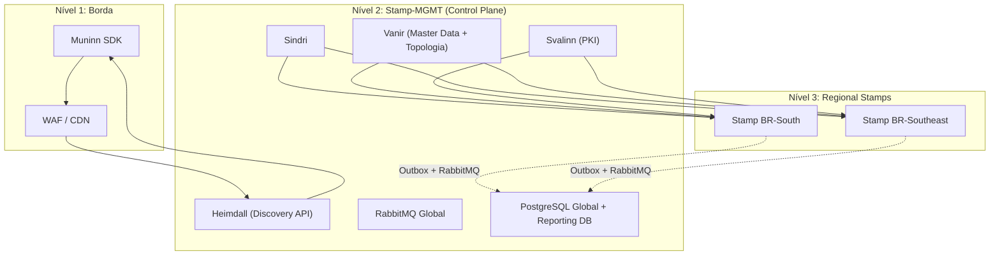
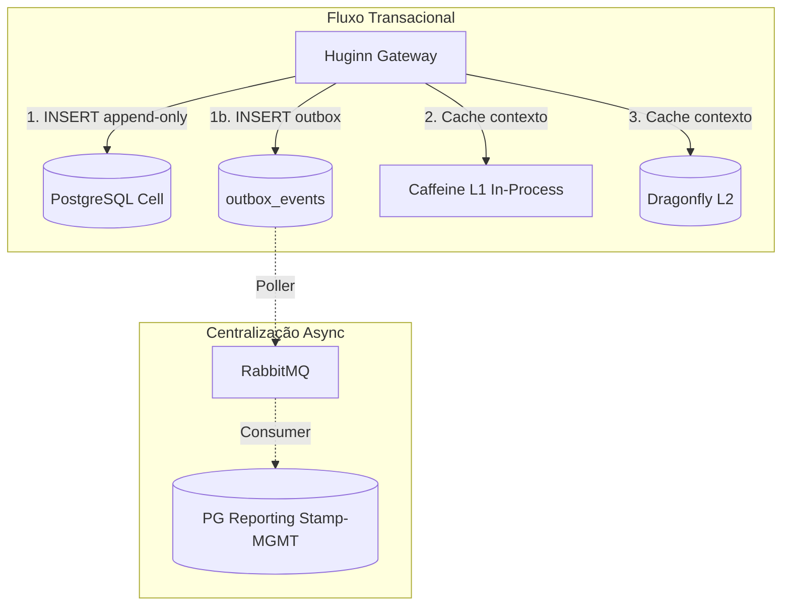
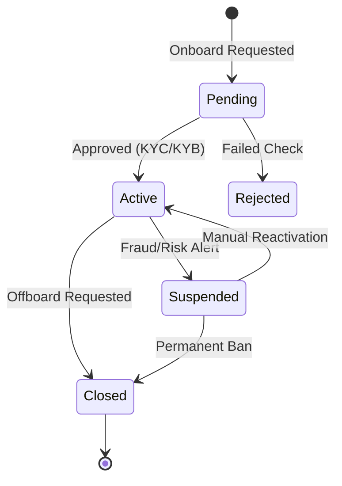
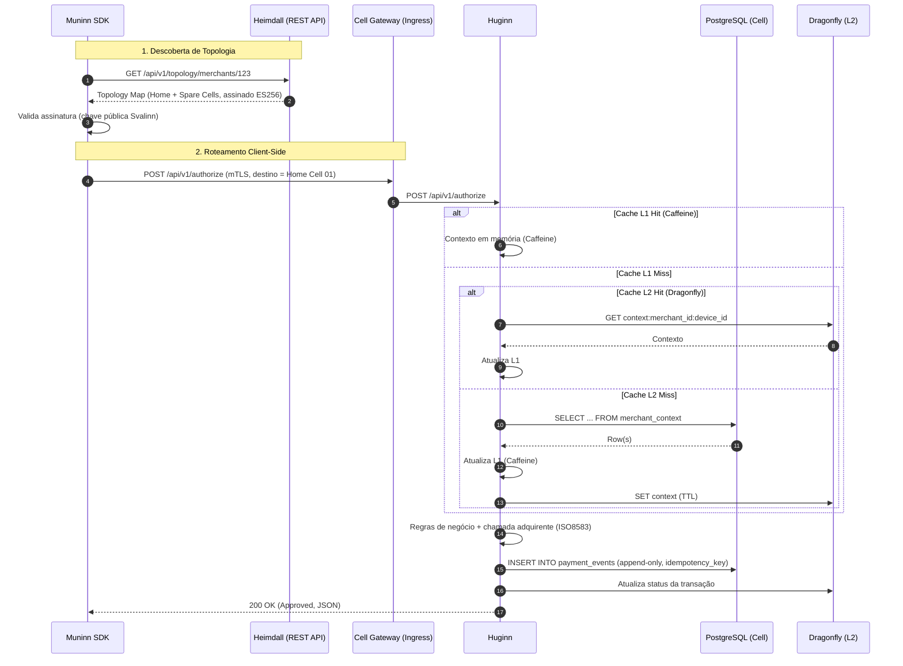

# Bifrost — Documento de Arquitetura de Solução (SAD)

**Versão:** 5.0.0 | **Status:** Final

---

## Histórico de Versões

| Versão | Data       | Descrição                                                                                                                |
| ------ | ---------- | ------------------------------------------------------------------------------------------------------------------------ |
| 5.2.0  | 2026-02-19 | **Simplificação Gateway.** Remoção de settlement/Forseti, Event Sourcing/CQRS, Projector/CDC. Modelo de dados simplificado para gateway transacional. |
| 5.1.0  | 2026-02-19 | **PostgreSQL por Cell.** Substituição do YugabyteDB por PostgreSQL (CloudNativePG). Centralização de dados via Outbox Pattern + RabbitMQ. Novo ADR-028. |
| 5.0.0  | 2026-02-19 | **Reestruturação por Serviço.** Documento reorganizado para ser consumido por agentes de IA. Cada serviço é self-contained. |
| 4.1.0  | 2026-02-19 | Remoção do Hash Chain (SHA-256). Auditoria via log append-only nativo.                                                   |
| 4.0.0  | 2026-02-19 | Simplificação Arquitetural. Remoção de Yggdrasil, Bifrost Chain, MinIO, gRPC. Absorção de Mimir no Huginn.               |
| 3.0.0  | 2026-01-09 | Bifrost Chain Architecture com Consenso PoA.                                                                             |

---

## 1. Visão Geral da Plataforma

O **Bifrost** é uma plataforma global de _Payments-as-Infrastructure_ multi-tenant, desenhada sob uma **Arquitetura Celular**. Entrega infraestrutura lógica dedicada (Single-Tenant Logic) sobre um substrato físico compartilhado (Multi-Tenant Physical).

### 1.1 Pilares Arquiteturais

1. **Inteligência na Borda (Edge-First):** roteamento resolvido no dispositivo pelo Muninn SDK (CSLB), guiado por mapas assinados do Heimdall. Sem load balancers centralizados como SPOF.

2. **Gravidade de Dados (Locality-Aware):** processamento na região de domicílio do Merchant (Home Stamp). Latência sub-200ms. Conformidade nativa com LGPD/GDPR.

3. **Sobrevivência Autônoma (Survival Units):** cada Cell processa transações localmente mesmo desconectada do backbone global (modo SiP). O SiP é gerenciado pelo Huginn com buffer em PVC local criptografado.

4. **Infraestrutura Orgânica:** escala via mitose em dois níveis — Cells (Brokkr) e Stamps (Sindri). Decisão baseada em métricas agregadas via Thanos/Prometheus.

### 1.2 Topologia Física

A plataforma opera em três camadas concêntricas:

**Nível 1 — Borda (Edge):** Muninn SDK, Heimdall REST API, CRL do Svalinn, WAF Global. Foco em latência e resiliência de bootstrapping.

**Nível 2 — Control Plane Global (Stamp-MGMT):** Vanir, Sindri, Heimdall, Svalinn, RabbitMQ Global, PostgreSQL Global (+ PostgreSQL Reporting alimentado via Outbox Pattern), Observabilidade Global. Otimizado para Consistência (CP).

**Nível 3 — Regional Infrastructure Stamps:** Vários Stamps por região, cada um com Brokkr, Huginn (cada Cell com seu PostgreSQL próprio), Dragonfly, observabilidade local. Otimizados para Disponibilidade (AP).



### 1.3 Conceitos Fundamentais

| Conceito             | Definição                                                                                                                                                           |
| :------------------- | :------------------------------------------------------------------------------------------------------------------------------------------------------------------ |
| **Stamp**            | Unidade física padrão: 1 Cluster K8s + 1 VPC. Cada Cell dentro do Stamp possui seu próprio PostgreSQL (gerenciado via CloudNativePG). Cada região pode conter N Stamps. |
| **Stamp-MGMT**       | Stamp especial dedicado ao Control Plane Global (Vanir, Sindri, Heimdall, Svalinn, RabbitMQ Global, PostgreSQL Global, observabilidade).                            |
| **Cell**             | Namespace lógico dentro de um Stamp que processa um subconjunto de tenants. Materializada como namespace K8s (`cell-<tenant>-<n>`).                                  |
| **Survival Unit**    | Cada Cell sobrevive sozinha (modo offline/SiP) mesmo desconectada do backbone global.                                                                               |
| **Geo-Partitioning** | Dados fixados fisicamente na região do Merchant (Home Stamp) para conformidade e latência.                                                                           |
| **Append-Only Log**  | Tabela `payment_events` onde transações são registradas por INSERT, sem UPDATE/DELETE. Garante auditoria e rastreabilidade (PCI-DSS).                                 |
| **SiP**              | _Stand-in Processing_. Modo de contingência com transações bufferizadas em PVC criptografado quando o DB está indisponível.                                         |
| **Outbox Pattern**   | Eventos persistidos em tabela `outbox_events` na mesma transação de escrita, publicados no RabbitMQ por poller assíncrono.                                           |

---

## 2. Padrões e Princípios Globais

Estes padrões se aplicam a **todos** os serviços da plataforma. Cada seção de serviço referencia quais padrões globais utiliza.

### 2.1 Runtime e Protocolos

- **Runtime padrão:** Java 21 / Quarkus 3.x para serviços core. Go 1.22 apenas para K8s Operators (Sindri, Brokkr).
- **Comunicação síncrona:** REST / JSON / OpenAPI 3.0. Contratos auto-documentados via Quarkus SmallRye OpenAPI.
- **Comunicação assíncrona:** RabbitMQ 3.13.x com exchanges `topic`. DLQ via `x-dead-letter-exchange`.
- **Protocolo legado:** ISO 8583 (1987) / TCP para compatibilidade com adquirentes.

### 2.2 Persistência

- **Banco relacional:** PostgreSQL 16+ por Cell (gerenciado via CloudNativePG Operator). Cada Cell possui sua própria instância isolada.
- **Modelo de escrita:** append-only (somente INSERT). Tabela `payment_events` registra cada transação. Sem UPDATE/DELETE (RBAC no banco).
- **Centralização de dados:** transações replicadas para PostgreSQL Reporting no Stamp-MGMT via Outbox Pattern + RabbitMQ (mesmo padrão do Vanir).
- **Auditoria:** imutabilidade via RBAC. `idempotency_key UNIQUE` previne duplicação. `created_at TIMESTAMPTZ` para rastreabilidade.
- **Cache L2:** Dragonfly v1.x (multi-threaded), cache puro LRU. Sem projeções persistentes. `default-ttl: 3600s`.

### 2.3 Segurança (Zero Trust)

- **Dispositivos → Bifrost:** mTLS com certificados X.509 emitidos pelo Svalinn (Device Identity).
- **Workloads → Workloads:** mTLS via SPIFFE/SPIRE + cert-manager (Workload Identity).
- **Humanos:** OIDC via Keycloak. Tokens apenas em APIs administrativas (nunca no caminho de autorização de pagamentos).

### 2.4 Observabilidade

- **Tracing:** W3C Trace Context (`traceparent`), propagado do Muninn até conectores ISO8583. OTEL Exporter + Tempo/Jaeger.
- **Logs:** JSON estruturado com correlação por `trace_id`, `merchant_id`, `device_id`, `stamp_id`. Quarkus `quarkus-logging-json`.
- **Métricas:** RED Method — Rate (TPS por Cell/Stamp/região), Errors (4xx/5xx por rota/adquirente), Duration (p50/p95/p99). Prometheus + Thanos.

### 2.5 Infraestrutura (Everything on Kubernetes)

- Todo serviço roda em Pods (Stamp-MGMT para globais, Stamps regionais para transacionais).
- Cargas stateful (PostgreSQL via CloudNativePG, RabbitMQ, Vault) como StatefulSets com Local PV.
- Dependências de cloud encapsuladas via Operators ou Crossplane.
- Dev/CI usa LocalStack para mocks de APIs AWS.

### 2.6 Deployment Zero-Downtime

- Deployment canário + feature flags + shift gradual via Heimdall (alterando pesos de Cells no mapa de topologia).
- Versionamento de mapas (`version`, `ttl_seconds`) com rollback via API.
- Upgrades de serviços globais no Stamp-MGMT com janelas planejadas, sem impacto transacional (cache + SiP absorvem).

### 2.7 Disaster Recovery (DR)

- **Stamp-MGMT:** PostgreSQL Global com streaming replication (primary + standby síncrono). RPO ≈ 0, RTO < 15 min.
- **Stamps regionais:** podem ser recriados a partir de estado no Sindri + metadados no Vanir. Backups gerenciados pelo CloudNativePG (continuous backup). RTO dependente de provisionamento de infraestrutura (ordem de horas).
- **Dados transacionais:** replicados via Outbox Pattern + RabbitMQ para PostgreSQL Reporting no Stamp-MGMT. RPO depende do lag do consumer (segundos em operação normal).

### 2.8 SLIs/SLOs Globais

| SLI                                  | SLO Target               | Observação                                    |
| :----------------------------------- | :------------------------ | :-------------------------------------------- |
| `p99_latency_authorize`              | < 200ms por região        | Caminho crítico de pagamento                  |
| `availability_transaction_path`      | ≥ 99.95% mensal           | Endpoint `/api/v1/authorize`                   |
| `outbox_replication_lag`             | < 5s                      | Lag do consumer Outbox → PG Reporting no Stamp-MGMT |
| `heimdall_map_update_latency`        | < 5s após evento crítico  | `CellUp`/`HomeAssigned`                        |
| `signature_integrity`                | 99.99%                    | Nenhum mapa inválido aceito pelo SDK           |
| `sip_data_loss`                      | 0 transações perdidas     | Validado por chaos engineering                 |

### 2.9 Testing Strategy

| Nível           | O Que Testa                                                        | Ferramentas                           | Cobertura Alvo                             |
| :-------------- | :----------------------------------------------------------------- | :------------------------------------ | :----------------------------------------- |
| **Unitário**    | Lógica de domínio (regras de pagamento, state machine, validações) | JUnit 5 + Mockito + AssertJ           | ≥ 80% do domínio                           |
| **Integração**  | Serviço ↔ PostgreSQL, Dragonfly, RabbitMQ                           | Quarkus @QuarkusTest + Testcontainers | Todos os adapters                          |
| **Contrato**    | Contratos REST entre serviços                                      | Pact (Consumer-Driven Contracts)      | Todos os pares de serviço                  |
| **E2E**         | Fluxo completo: Muninn → Ingress → Huginn → DB → resposta          | Staging + k6/Gatling                  | authorize, capture, cancel, refund         |
| **Performance** | SLAs: p99 < 200ms, TPS por Cell                                    | k6/Gatling com carga sustentada       | baseline + stress + soak                   |
| **Chaos**       | Resiliência: kill DB, kill RabbitMQ, network partition             | Chaos Mesh (K8s native)               | SiP, failover, outbox lag                 |
| **Segurança**   | mTLS, certificados, injeção, OWASP Top 10                          | OWASP ZAP + Trivy + Snyk              | Pipeline CI/CD                             |

---

## 3. Huginn — Gateway de Pagamentos

### 3.1 Objetivo

Huginn é o gateway transacional da plataforma. Recebe transações de pagamento, resolve o protocolo EMV, roteia para a adquirente correta e retorna a resposta. Stateless por design, com cache L1 in-process e buffer SiP para contingência. Não faz liquidação — opera exclusivamente como gateway.

### 3.2 Responsabilidades

- Processamento de transações: authorize, capture, cancel, refund.
- Módulo de protocolo EMV/BIN/CAPK (`huginn-protocol-module`) — resolve tabelas EMV, valida BIN ranges, gerencia CAPK.
- Cache L1 in-process (Caffeine) com invalidação via eventos RabbitMQ — cachea contexto de merchant/device.
- Stand-in Processing (SiP) — buffer em PVC local criptografado para contingência.
- Conexão direta com adquirentes via ISO 8583 / TCP.
- Registro de transações em tabela append-only (`payment_events`) para auditoria e centralização via Outbox.

### 3.3 Stack Tecnológico

| Componente           | Tecnologia                       | Detalhes                                                                           |
| :------------------- | :------------------------------- | :--------------------------------------------------------------------------------- |
| **Runtime**          | Java 21 / Quarkus 3.x            | Stateless. Deployment como `huginn-core` dentro de cada Cell.                      |
| **Banco**            | PostgreSQL 16+ (por Cell)        | Instância dedicada gerenciada por CloudNativePG. Tabela `payment_events`.          |
| **Cache L1**         | Caffeine (in-process)            | `max-size: 10000`, `ttl: 30s`. Invalidado por `MasterDataChanged` via RabbitMQ.   |
| **Cache L2**         | Dragonfly (RESP protocol)        | Cache puro LRU. Proteção de DB.                                                    |
| **Mensageria**       | RabbitMQ Regional (AMQP)         | Consome eventos de Master Data. Publica eventos transacionais locais.              |
| **Protocolo legado** | ISO 8583 (1987) / TCP            | Comunicação com adquirentes (Cielo, Rede, Stone, etc.).                            |
| **SiP buffer**       | PVC local criptografado          | Buffer de contingência em disco. Detalhes de criptografia e sizing na modelagem do Huginn. |

### 3.4 Padrões Arquiteturais

- **Append-Only Log:** transações registradas em `payment_events` (somente INSERT). Auditoria e rastreabilidade garantidas por RBAC + `idempotency_key`.
- **Locality-Aware:** processamento na região do Home Stamp do Merchant. Sem transações síncronas intercontinentais.
- **Survival Unit:** opera isoladamente com dependências mínimas (PG local + cache).
- **Circuit Breaker:** entre Huginn e conectores ISO8583 (timeouts rígidos) e entre Huginn e PostgreSQL local (ativa SiP quando aberto).
- **Outbox Pattern:** além do log transacional, Huginn persiste na tabela `outbox_events` (mesma transação). Poller publica no RabbitMQ para centralização no Stamp-MGMT.

### 3.5 Dados Gerenciados

```sql
CREATE TABLE payment_events (
    id BIGSERIAL PRIMARY KEY,
    operation VARCHAR(20) NOT NULL,        -- authorize, capture, cancel, refund
    status VARCHAR(20) NOT NULL,           -- approved, declined, timeout, error
    idempotency_key VARCHAR(64) NOT NULL UNIQUE,
    merchant_id VARCHAR(36) NOT NULL,
    device_id VARCHAR(36) NOT NULL,
    stamp_id VARCHAR(36) NOT NULL,
    amount BIGINT NOT NULL,                -- valor em centavos
    currency VARCHAR(3) NOT NULL,          -- ISO 4217
    acquirer_response JSONB,               -- resposta da adquirente
    created_at TIMESTAMPTZ NOT NULL DEFAULT NOW()
);
-- RBAC: role 'huginn_writer' tem apenas INSERT. Nenhuma role tem UPDATE/DELETE.
```

Fluxo de escrita:



### 3.6 Stand-in Processing (SiP)

Quando circuit breaker do PostgreSQL local abre:

1. Huginn ativa modo SiP, persiste eventos em PVC local criptografado.
2. Continua respondendo conforme política (aprovar/recusar conservadoramente).
3. Formato: arquivo append-only com registros delimitados, cada um com `idempotency_key`.

Drenagem (circuit breaker half-open → closed):

1. Scheduler interno lê PVC sequencialmente.
2. Cada evento é reenviado com `idempotency_key` original.
3. INSERT duplicado ignorado via conflict clause.
4. Métricas emitidas: `huginn_sip_drain_events_total`, `huginn_sip_drain_duration_seconds`.

| Regra                   | Descrição                                                                         |
| :---------------------- | :-------------------------------------------------------------------------------- |
| Transações em SiP       | Apenas `authorize` com valor ≤ limite configurado (limita risco financeiro)       |
| Encriptação do buffer   | PVC criptografado at-rest (requisito PCI-DSS). Detalhes na modelagem do Huginn.   |
| Drenagem                | Idempotency-based: `idempotency_key` garante exactly-once na reconciliação        |

### 3.7 Interfaces

**Expõe (REST/JSON):**

| Endpoint                | Método | Descrição                      | SLO Latência (p95) | SLO Disponibilidade |
| :---------------------- | :----- | :----------------------------- | :------------------ | :------------------ |
| `/api/v1/authorize`     | POST   | Autorização de pagamento       | < 150ms             | 99.95%              |
| `/api/v1/capture`       | POST   | Captura de transação           | < 150ms             | 99.95%              |
| `/api/v1/cancel`        | POST   | Cancelamento                   | < 150ms             | 99.95%              |
| `/api/v1/refund`        | POST   | Estorno                        | < 150ms             | 99.95%              |
| `/admin/audit/events`   | GET    | Consulta de auditoria on-demand | < 500ms             | 99.9%               |

Campos core do payload: `merchant_id`, `device_id`, `idempotency_key`, `amount`, `currency`, `pan_token`, `product`, `installments`.

Regras: `idempotency_key` obrigatória (Exactly-Once). Versionamento: `/api/v1/` no path, deprecation policy de 6 meses.

**Consome:**

| Origem     | Interface                        | Protocolo     | Propósito                                   |
| :--------- | :------------------------------- | :------------ | :------------------------------------------ |
| PostgreSQL | JDBC (local à Cell)              | SQL           | Log transacional + dados de contexto        |
| Dragonfly  | `GET/SET context:*`              | RESP          | Cache L2                                    |
| RabbitMQ   | `MasterDataChanged` (consumer)   | AMQP          | Invalidação de cache L1                     |
| Adquirentes | Conexão TCP direta              | ISO 8583      | Autorização/captura junto a bandeiras       |

### 3.8 Métricas e Alertas Específicos

| Métrica                                         | Warning        | Critical       | Ação                                             |
| :---------------------------------------------- | :------------- | :------------- | :----------------------------------------------- |
| `huginn_authorize_duration_seconds{q="0.99"}`   | > 150ms        | > 200ms        | Investigar cache miss rate, DB latency, network  |
| `up{job="huginn"}` + blackbox probe             | < 99.99% (5m)  | < 99.95% (5m)  | Verificar pods, readiness probes, DB health      |
| `rate(huginn_requests_total{status=~"5.."}[5m])` | > 1%           | > 5%           | Verificar logs, circuit breakers, DB errors      |
| `huginn_sip_active{stamp="*"}`                  | = 1            | = 1 por > 5min | DB down. Verificar PostgreSQL health             |
| `huginn_sip_buffer_bytes / capacity`            | > 70%          | > 90%          | Buffer quase cheio. DB precisa voltar urgente    |

### 3.9 Onde Roda

Dentro de cada **Cell** em Stamps Regionais (Nível 3). Deployment: `huginn-core` (stateless, com PVC para SiP buffer). Namespace: `cell-<tenant>-<n>`.

### 3.10 Dependências

- **Hard:** PostgreSQL local da Cell (journal), Dragonfly (cache L2).
- **Soft (degrada sem):** RabbitMQ Regional (eventos async), Adquirentes (ISO8583).
- **Contingência:** SiP buffer absorve indisponibilidade do DB.

---

## 4. Muninn — Client SDK

### 4.1 Objetivo

SDK inteligente que roda no dispositivo do cliente (terminal POS, app mobile). Responsável por roteamento client-side (CSLB), validação de mapas de topologia assinados, e estabelecimento de mTLS.

### 4.2 Responsabilidades

- Client-Side Load Balancing (CSLB) — resolve o destino da transação no dispositivo.
- Consulta e cache local de mapas de topologia do Heimdall.
- Validação de assinatura dos mapas (ES256, chave pública do Svalinn embarcada).
- Estabelecimento de mTLS com o Home Cell (certificado emitido pelo Svalinn).
- Failover automático da Home Cell para Spare Cells (header `x-failover-origin`).
- Coleta de dados de telemetria (geo, device, network) para enriquecimento.
- Fallback: se Heimdall indisponível, usa último mapa cacheado localmente. Se TTL expirou, tenta Anycast DNS.

### 4.3 Stack Tecnológico

| Componente         | Tecnologia                        | Detalhes                                            |
| :----------------- | :-------------------------------- | :-------------------------------------------------- |
| **Plataformas**    | Kotlin (Android), Swift (iOS), C++ (embedded), Node.js (web) | Cobertura multi-plataforma                          |
| **Segurança**      | mTLS + Secure Enclave             | Par de chaves gerado no Secure Enclave do dispositivo |
| **Cache local**    | Storage nativo do dispositivo     | Mapas de topologia cacheados com TTL                 |

### 4.4 Padrões Arquiteturais

- **Edge-First:** toda inteligência de roteamento está no SDK, não em load balancers centralizados.
- **CSLB (Client-Side Load Balancing):** SDK decide para qual Cell enviar a transação.
- **Failover automático:** se Home Cell não responde, SDK redireciona para Spare Cells.

### 4.5 Interfaces

**Consome:**

| Origem   | Endpoint                                   | Protocolo  | Propósito                        |
| :------- | :----------------------------------------- | :--------- | :------------------------------- |
| Heimdall | `GET /api/v1/topology/merchants/{id}`       | HTTPS GET  | Mapa de topologia assinado       |
| Svalinn  | Certificado X.509 (ativação do dispositivo) | mTLS       | Device Identity                  |
| Huginn   | `POST /api/v1/authorize` (via Gateway)      | HTTPS+mTLS | Transação de pagamento            |

**Expõe:** nada (é um SDK client-side).

### 4.6 Fluxo Principal

1. SDK consulta Heimdall → recebe mapa de topologia (Home Cell + Spare Cells, assinado ES256).
2. SDK valida assinatura com chave pública embarcada.
3. SDK envia transação para Home Cell via mTLS.
4. Se Home Cell falha → failover para Spare Cells com `x-failover-origin`.
5. Se Heimdall indisponível → usa mapa cacheado (respeitando TTL) → último recurso: Anycast DNS.

### 4.7 Onde Roda

No **dispositivo do cliente** (terminal POS, app mobile, web). Não roda em infraestrutura Bifrost.

### 4.8 Dependências

- **Hard:** Heimdall (descoberta de topologia), Svalinn (certificado para mTLS).
- **Soft (degrada sem):** Heimdall (usa cache local de mapas).

---

## 5. Vanir — Control Plane / Master Data

### 5.1 Objetivo

Hub Global de Master Data, Placement e Topologia. Fonte única de verdade para dados cadastrais, regras de alocação e catálogo de Stamps/Cells. Publica eventos via Outbox Pattern para manter o ecossistema sincronizado.

### 5.2 Responsabilidades

- CRUD de entidades de domínio: Merchants, Stores, Terminals, Devices, Products, Activation Policies.
- Placement Rules — decide Home Stamp com base em regras de negócio + capacidade (consulta Sindri).
- Catálogo de Topologia — mapa de Stamps, Cells e sua relação com Merchants.
- Publicação de eventos de domínio via Outbox Pattern + RabbitMQ Global.
- Gestão do ciclo de vida de entidades (state machine: Pending → Active → Suspended → Closed).
- Fonte de verdade consultada por Heimdall (topologia) e Svalinn (validação de Merchant na ativação de dispositivo).

### 5.3 Stack Tecnológico

| Componente     | Tecnologia                                  | Detalhes                                                       |
| :------------- | :------------------------------------------ | :------------------------------------------------------------- |
| **Runtime**    | Java 21 / Quarkus 3.x                       | Serviço REST stateless.                                        |
| **Banco**      | PostgreSQL Global (HA via streaming replication) no Stamp-MGMT | Fonte de verdade. Schemas: merchants, devices, topology, etc.  |
| **Mensageria** | RabbitMQ Global (AMQP)                       | Publica via Outbox Pattern: `MerchantCreated`, `CellUp`, `HomeAssigned`, `MasterDataChanged`. |
| **Outbox**     | Tabela `outbox_events` + poller assíncrono   | Consistência entre escrita e publicação de eventos.            |

### 5.4 Padrões Arquiteturais

- **Outbox Pattern:** garante consistência entre escrita no banco e publicação de eventos. Poller assíncrono lê tabela `outbox_events` e publica no RabbitMQ.
- **Fonte de verdade:** Vanir é a origem dos dados cadastrais e de topologia. Heimdall/Huginn consomem dados derivados via cache.
- **State Machine:** entidades seguem máquinas de estado explícitas (Pending → Active → Suspended → Closed).



### 5.5 Interfaces

**Expõe (REST/JSON):**

| Endpoint                                         | Método   | Descrição                           |
| :----------------------------------------------- | :------- | :---------------------------------- |
| `/api/v1/merchants`                              | POST/GET | CRUD de Merchants                   |
| `/api/v1/merchants/{id}`                          | PUT/GET  | Gestão de Merchant individual       |
| `/api/v1/devices`                                 | POST/GET | CRUD de Devices                     |
| `/api/v1/topology/stamps`                         | GET      | Catálogo de Stamps                  |
| `/api/v1/topology/merchants/{id}/placement`       | GET      | Regra de placement do Merchant      |

**Publica eventos (RabbitMQ Global via Outbox):**

`MerchantCreated`, `MerchantUpdated`, `MerchantSuspended`, `DeviceActivated`, `CellUp`, `CellDown`, `HomeAssigned`, `MasterDataChanged`.

**Consome:**

| Origem | Interface            | Propósito                              |
| :----- | :------------------- | :------------------------------------- |
| Sindri | API REST             | Consulta capacidade para Placement     |

### 5.6 Consistência

- **No Stamp-MGMT:** consistência forte (escrita direto no PostgreSQL Global).
- **Nos Stamps regionais:** consistência eventual (segundos) via RabbitMQ + Outbox.
- **Topologia:** controlada por eventos de placement. Huginn invalida cache L1 ao receber `MasterDataChanged`.

### 5.7 Onde Roda

**Stamp-MGMT** (Nível 2 — Control Plane Global).

### 5.8 Dependências

- **Hard:** PostgreSQL Global, RabbitMQ Global.
- **Soft:** Sindri (consulta capacidade para Placement).

---

## 6. Svalinn — Segurança e PKI

### 6.1 Objetivo

PKI e gestão de identidade criptográfica. Emite certificados para dispositivos e workloads, gerencia mTLS e expõe CRLs. É o "escudo" que garante a cadeia de confiança da plataforma.

### 6.2 Responsabilidades

- Emissão de certificados X.509 para dispositivos (Muninn) via fluxo CSR + ActivationCode.
- Gerenciamento de mTLS via integração com HashiCorp Vault e SPIFFE/SPIRE.
- Publicação de Certificate Revocation Lists (CRL) via API REST.
- Assinatura de mapas de topologia do Heimdall (ES256).
- Rotação de certificados e gestão de ciclo de vida.
- Integração com cert-manager para workload identity.

### 6.3 Stack Tecnológico

| Componente       | Tecnologia                           | Detalhes                                               |
| :--------------- | :----------------------------------- | :----------------------------------------------------- |
| **Runtime**      | Java 21 / Quarkus 3.x                | Serviço REST stateless.                                |
| **Vault**        | HashiCorp Vault                      | Backend de PKI. Armazena CA raiz e intermediárias.     |
| **SPIFFE/SPIRE** | SPIFFE/SPIRE                         | Workload Identity para comunicação entre serviços.     |
| **cert-manager** | cert-manager (K8s)                   | Automação de emissão/rotação de certificados.          |
| **Banco**        | PostgreSQL Global (compartilhado)    | Audit log de operações de PKI.                         |

### 6.4 Padrões Arquiteturais

- **Zero Trust:** toda comunicação autenticada. Nenhum serviço confia em outro sem certificado válido.
- **Device Identity:** cada dispositivo tem identidade criptográfica única (certificado X.509).
- **Workload Identity:** SPIFFE/SPIRE para mTLS entre pods.

### 6.5 Interfaces

**Expõe (REST/JSON):**

| Endpoint                            | Método | Descrição                                |
| :---------------------------------- | :----- | :--------------------------------------- |
| `/api/v1/certificates/issue`        | POST   | Emissão de certificado via CSR           |
| `/api/v1/certificates/{id}/revoke`  | POST   | Revogação de certificado                 |
| `/api/v1/certificates/{id}/rotate`  | POST   | Rotação de certificado                   |
| `/api/v1/crl/{issuer}`             | GET    | Certificate Revocation List              |

**Consome:**

| Origem | Interface      | Propósito                                |
| :----- | :------------- | :--------------------------------------- |
| Vanir  | REST API       | Valida Merchant na ativação de dispositivo |
| Vault  | Vault API      | Backend de PKI                           |

### 6.6 Métricas e Alertas Específicos

| Métrica                      | Warning    | Critical  | Ação                 |
| :--------------------------- | :--------- | :-------- | :------------------- |
| `svalinn_cert_expiry_days`   | < 30 dias  | < 7 dias  | Forçar rotação       |

### 6.7 Onde Roda

**Stamp-MGMT** (Nível 2 — Control Plane Global).

### 6.8 Dependências

- **Hard:** HashiCorp Vault, PostgreSQL Global.
- **Soft:** Vanir (validação de Merchant), SPIFFE/SPIRE (workload identity).

---

## 7. Heimdall — Discovery Service

### 7.1 Objetivo

Serviço de descoberta que expõe mapas de topologia via API REST. É a ponte entre Vanir (fonte de verdade) e Muninn (SDK). Mapas são assinados pelo Svalinn para garantir integridade.

### 7.2 Responsabilidades

- Servir mapas de topologia (Home Cell + Spare Cells) para o Muninn SDK.
- Consultar Vanir para dados de topologia atualizados.
- Cachear mapas em Dragonfly para performance.
- Solicitar assinatura dos mapas ao Svalinn (ES256).
- Consumir eventos de topologia do RabbitMQ para atualizar cache proativamente.
- Suportar versionamento de mapas (`version`, `ttl_seconds`) com rollback.

### 7.3 Stack Tecnológico

| Componente    | Tecnologia                | Detalhes                                             |
| :------------ | :------------------------ | :--------------------------------------------------- |
| **Runtime**   | Java 21 / Quarkus 3.x     | Serviço REST stateless.                              |
| **Cache**     | Dragonfly (RESP)          | Mapas de topologia cacheados. TTL configurável.      |
| **Mensageria** | RabbitMQ Global (AMQP)   | Consome `CellUp`, `CellDown`, `HomeAssigned`.         |

### 7.4 Padrões Arquiteturais

- **Cache de topologia:** Heimdall mantém uma versão cacheada e assinada dos dados de topologia do Vanir.
- **Cache-aside:** consulta Dragonfly primeiro, fallback para Vanir, cachea resultado.
- **Signed Maps:** integridade dos mapas garantida por assinatura ES256 do Svalinn.

### 7.5 Interfaces

**Expõe (REST/JSON):**

| Endpoint                                     | Método | Descrição                        | SLO Latência (p95) | SLO Disponibilidade |
| :------------------------------------------- | :----- | :------------------------------- | :------------------ | :------------------ |
| `/api/v1/topology/merchants/{merchant_id}`   | GET    | Mapa de topologia assinado       | < 50ms (global)     | 99.99%              |

Payload: JSON assinado com `home_cell`, `spare_cells`, `ttl_seconds`, `strategy`, `integrity` (alg, kid, signature, issued_at, expires_at).

**Consome:**

| Origem    | Interface                       | Propósito                          |
| :-------- | :------------------------------ | :--------------------------------- |
| Vanir     | REST API                        | Dados de topologia (fonte de verdade) |
| Svalinn   | REST API                        | Assinatura ES256 dos mapas         |
| RabbitMQ  | `CellUp`, `HomeAssigned` events | Atualização proativa de cache      |
| Dragonfly | RESP                            | Cache de mapas                     |

### 7.6 Métricas e Alertas Específicos

| Métrica                               | Warning | Critical | Ação                            |
| :------------------------------------ | :------ | :------- | :------------------------------ |
| `dragonfly_keyspace_hits / (h + m)`   | < 70%   | < 50%    | TTL muito curto ou cache pequeno |

### 7.7 Onde Roda

**Stamp-MGMT** (Nível 2 — Control Plane Global). CDN opcional como camada de edge.

### 7.8 Dependências

- **Hard:** Vanir (fonte de verdade), Svalinn (assinatura), Dragonfly (cache).
- **Soft:** RabbitMQ Global (atualização proativa — sem ele, funciona por polling/TTL).

---

## 8. Sindri — Operador de Infraestrutura Global

### 8.1 Objetivo

Operador Global que provisiona Infrastructure Stamps (Clusters K8s + DB + VPC) quando a capacidade regional se esgota. Gerencia o ciclo de vida de Stamps a partir do Stamp-MGMT.

### 8.2 Responsabilidades

- Provisionamento de novos Stamps (Cluster K8s + VPC) via Crossplane + CAPI.
- Monitoramento de capacidade agregada via Thanos/Prometheus.
- Rotação de Stamps (Blue/Green de clusters).
- Drenagem e destruição de Stamps subutilizados.
- Exposição de métricas de capacidade para Vanir (Placement).

### 8.3 Stack Tecnológico

| Componente        | Tecnologia                   | Detalhes                                                        |
| :---------------- | :--------------------------- | :-------------------------------------------------------------- |
| **Runtime**       | Go 1.22 (K8s Operator)       | Custom Resource Definitions (CRDs) para Stamps.                |
| **IaC**           | Crossplane + CAPI             | Provisionamento multi-cloud de infraestrutura.                  |
| **State Store**   | PostgreSQL Global              | Backend de estado no Stamp-MGMT.                                |
| **Observabilidade** | Thanos/Prometheus           | Métricas agregadas de todos os Stamps para decisão de escala.   |

### 8.4 Interfaces

**Expõe (REST/JSON):**

| Endpoint                         | Método | Descrição                             |
| :------------------------------- | :----- | :------------------------------------ |
| `/api/v1/stamps`                 | GET    | Lista de Stamps e status              |
| `/api/v1/stamps/{id}/capacity`   | GET    | Capacidade do Stamp                   |
| `/api/v1/stamps/provision`       | POST   | Provisionamento de novo Stamp          |
| `/api/v1/stamps/{id}/drain`      | POST   | Drenagem de Stamp                     |

**Consome:**

| Origem              | Interface         | Propósito                          |
| :------------------ | :---------------- | :--------------------------------- |
| Thanos/Prometheus   | PromQL queries    | Métricas de capacidade agregadas   |
| Crossplane/CAPI     | K8s CRDs          | Provisionamento de infraestrutura  |

### 8.5 Regras de Escala

| Regra                | Threshold                          | Ação                                       |
| :------------------- | :--------------------------------- | :----------------------------------------- |
| Criar novo Stamp     | Stamp > 80% capacidade por 7 dias  | Sindri provisiona novo Stamp               |
| NÃO criar Stamp      | Capacidade resolvida via HPA       | Brokkr escala Cells primeiro (mais barato) |
| Drenar Stamp         | Stamp < 20% utilização por 30 dias | Migrar tenants, drenar, destruir           |

### 8.6 Onde Roda

**Stamp-MGMT** (Nível 2 — Control Plane Global).

### 8.7 Dependências

- **Hard:** PostgreSQL Global (state store), Crossplane/CAPI (provisionamento).
- **Soft:** Thanos/Prometheus (métricas para decisão).

---

## 9. Brokkr — Operador de Cells Local

### 9.1 Objetivo

Operador Local (por Stamp) que gerencia o ciclo de vida lógico das Cells dentro de um Stamp. Materializa namespaces, aplica templates e escala horizontalmente.

### 9.2 Responsabilidades

- Criação de Cells (namespace K8s `cell-<tenant>-<n>`) a partir de Cell Templates.
- Escala horizontal de Cells via HPA (baseado em métricas de CPU/TPS).
- Cell Splitting — isolar tenants ruidosos em novas Cells.
- Aplicação de ConfigMaps, Secrets e Services de entrada por Cell.
- Deployment de `huginn-core` dentro de cada Cell.

### 9.3 Stack Tecnológico

| Componente  | Tecnologia               | Detalhes                                              |
| :---------- | :------------------------ | :---------------------------------------------------- |
| **Runtime** | Go 1.22 (K8s Operator)    | CRDs para Cells. Um Brokkr por Stamp.                |
| **K8s API** | Kubernetes API (client-go) | Cria namespaces, deployments, HPA, services.          |

### 9.4 Padrões Arquiteturais

- **Operator Pattern:** Brokkr é um K8s Operator que reconcilia o estado desejado das Cells.
- **Cell Template:** template padrão que define a composição de uma Cell (huginn-core, configmaps, secrets, services).
- **Cell Splitting:** quando um tenant gera carga excessiva, Brokkr cria uma Cell dedicada e migra o tenant.

### 9.5 Interfaces

**Expõe:** CRDs do Kubernetes (Custom Resources: `Cell`, `CellTemplate`).

**Consome:**

| Origem | Interface        | Propósito                     |
| :----- | :--------------- | :---------------------------- |
| Vanir  | Eventos RabbitMQ | `CellUp`/`CellDown` triggers |
| K8s    | Kubernetes API   | Gestão de recursos            |

### 9.6 Onde Roda

Dentro de cada **Stamp Regional** (Nível 3). Um Brokkr por Stamp, no namespace `bifrost-system`.

### 9.7 Dependências

- **Hard:** Kubernetes API.
- **Soft:** Vanir (eventos de placement via RabbitMQ Regional).

---

## 10. Ferramentas e Suporte

| Nome                  | Tipo          | Stack          | Responsabilidade                                                          |
| :-------------------- | :------------ | :------------- | :------------------------------------------------------------------------ |
| `bifrost-cli`         | CLI           | Java / Quarkus | Ferramenta para SREs/Plataforma. Orquestra Sindri, Heimdall, Svalinn e Vanir. |
| `bifrost-console-bff` | Service (BFF) | Java / Quarkus | Backend do Portal Bifrost. Agrega APIs.                                   |
| `bifrost-portal`      | Frontend      | React / Next.js | Console Web para visão de Stamps, Cells, Merchants, capacidade e saúde.  |

---

## 11. Fluxos Cross-Service

### 11.1 Fluxo de Autorização (Venda)



### 11.2 Fluxo de Onboarding (Merchant + Device)

1. **Cadastro Lógico:** Merchant criado no Vanir via Portal/REST API.
2. **Placement:** Vanir decide Home Stamp (consulta capacidade via Sindri).
3. **Provisionamento de Cell:** Brokkr cria ou reutiliza Cell, aplicando Cell Template.
4. **Publicação de Topologia:** Eventos `CellUp` e `HomeAssigned` via Outbox + RabbitMQ → Heimdall atualiza cache.
5. **Ativação de Dispositivo:** Muninn gera par de chaves no Secure Enclave, envia CSR + ActivationCode para Svalinn (que valida Merchant via Vanir), recebe certificado X.509.
6. **Primeira Transação:** Muninn consulta mapa do Heimdall, estabelece mTLS com Home Cell, transaciona.

### 11.3 Cenários de Chaos Engineering

| Cenário                                  | O Que Validar                                             | Critério de Sucesso                                             |
| :--------------------------------------- | :-------------------------------------------------------- | :-------------------------------------------------------------- |
| Kill PostgreSQL da Cell (5 min)          | SiP ativa, transações continuam, buffer drena ao retornar | Zero transações perdidas, < 500ms latência extra durante SiP    |
| Kill RabbitMQ regional                   | Huginn processa transações (mensageria é async)           | Transações não impactadas. Eventos enfileirados localmente      |
| Particionar Stamp do Stamp-MGMT (30 min) | Stamp opera autonomamente                                 | Zero impacto em authorize/capture. Master Data usa cache local  |
| Outbox consumer lag > 30s                | Alertas disparam, Portal mostra dados stale               | Alerta < 1 min. Portal exibe banner "dados desatualizados"      |
| OOM kill de um Pod Huginn                | K8s reinicia, Muninn faz failover para Spare Cell         | Recovery < 30s. Sem perdas (idempotency_key previne duplicatas) |

---

## 12. Cost Model

### 12.1 Composição de Custo por Stamp Regional

| Componente                   | Recursos Típicos           | Custo Estimado Mensal |
| :--------------------------- | :------------------------- | :-------------------- |
| K8s Cluster (3 nodes mínimo) | 3x 4vCPU, 16GB             | ~$450                 |
| PostgreSQL (por Cell, via CloudNativePG) | Primary + replica por Cell. Sizing na modelagem. | Variável por Cell |
| Dragonfly (1 instância)      | 2vCPU, 16GB RAM            | ~$120                 |
| RabbitMQ (3 nodes quorum)    | 3x 2vCPU, 8GB              | ~$250                 |
| Networking                   | ~2TB/mês tráfego           | ~$200                 |
| **Total por Stamp**          |                            | **~$1.670/mês**       |

### 12.2 Regras de Right-Sizing

| Regra                | Threshold                          | Ação                                       |
| :------------------- | :--------------------------------- | :----------------------------------------- |
| Criar novo Stamp     | Stamp > 80% capacidade por 7 dias  | Sindri provisiona novo Stamp               |
| NÃO criar Stamp      | Capacidade resolvida via HPA       | Brokkr escala Cells primeiro (mais barato) |
| Drenar Stamp         | Stamp < 20% utilização por 30 dias | Migrar tenants, drenar, destruir           |

### 12.3 Métrica-Chave

```
custo_por_transacao = custo_total_infra_mensal / total_transacoes_mensais
Target: < R$ 0,003 por transação (em escala de 100M+ TXN/mês)
```

---

## 13. Dashboards Obrigatórios

| Dashboard             | Conteúdo                                                                                         |
| :-------------------- | :----------------------------------------------------------------------------------------------- |
| **Bifrost Global**    | Mapa de Stamps, status (green/yellow/red), TPS global, SiP active count, outbox replication lag  |
| **Stamp Detail**      | TPS por Cell, latência p50/p95/p99, error rate, Dragonfly hit rate, DB connections, RabbitMQ depth |
| **Transaction Flow**  | Trace de uma transação (Muninn → Ingress → Huginn → DB), com breakdown de cada etapa             |
| **SiP Monitor**       | Stamps em SiP, tamanho do buffer, taxa de drenagem, transações pendentes                         |
| **Capacity Planning** | CPU/Memory por Stamp, HPA events, Stamp utilization %, projeção de crescimento                   |

---

## 14. Registros de Decisão Arquitetural (ADRs)

| ID                  | Título                                                                              | Escopo         |
| :------------------ | :---------------------------------------------------------------------------------- | :------------- |
| ADR-BIFROST-001     | PostgreSQL por Cell como banco padrão (CloudNativePG Operator)                        | Dados          |
| ADR-BIFROST-002     | Log transacional append-only com PostgreSQL (auditoria PCI-DSS)                       | Dados          |
| ADR-BIFROST-003     | Everything on Kubernetes (Stamps + Stamp-MGMT)                                       | Infra          |
| ADR-BIFROST-004     | Topologia Física em Stamps                                                           | Infra          |
| ADR-BIFROST-005     | Inteligência na Borda (CSLB + Heimdall + Muninn)                                    | Edge           |
| ADR-BIFROST-006     | Matriz de Autenticação Zero-Trust                                                    | Segurança      |
| ADR-BIFROST-007     | Fluxo de Leitura Otimizado (Caffeine L1 + Dragonfly L2)                              | Dados          |
| ADR-BIFROST-008     | Dragonfly como Cache L2 (somente cache, sem projeções persistentes)                  | Desempenho     |
| ADR-BIFROST-009     | Uso de LocalStack em Dev/CI para mocks de provedores                                 | DevOps         |
| ADR-BIFROST-010     | Arquitetura Locality-Aware com Geo-Partitioning por Home Region                      | Arquitetura    |
| ADR-BIFROST-011     | Arquitetura Celular com Survival Units                                               | Resiliência    |
| ADR-BIFROST-012     | Modelo append-only para log transacional (sem UPDATE/DELETE)                          | Dados          |
| ADR-BIFROST-013     | Modelo de Consistência Híbrido (CP para Eventos, AP para Master Data)                | Consistência   |
| ADR-BIFROST-014     | Topologia de Dados Multi-Stamp: Hot Data Local, Master Data Replicado                | Dados          |
| ADR-BIFROST-016     | Stack de Observabilidade com OpenTelemetry e Prometheus                               | Observabilidade |
| ADR-BIFROST-017-v2  | Java 21/Quarkus como runtime padrão (Go apenas para Operators K8s)                   | Stack          |
| ADR-BIFROST-018     | RabbitMQ para Mensageria Assíncrona                                                  | Mensageria     |
| ADR-BIFROST-019     | Mecanismo de Stand-in Processing (SiP) com buffer no Huginn                          | Resiliência    |
| ADR-BIFROST-021     | Estratégia de Provisionamento de Identidade e Segredos (Global vs Local)             | Segurança      |
| ADR-BIFROST-022     | REST/JSON com OpenAPI 3.0 para todos os contratos                                    | Interfaces     |
| ADR-BIFROST-024     | Remoção do Yggdrasil: redistribuição para Huginn, Vanir e PostgreSQL                  | Arquitetura    |
| ADR-BIFROST-025     | Remoção do MinIO: APIs REST, PostgreSQL e cloud-native object storage                 | Storage        |
| ADR-BIFROST-026     | Absorção de Mimir como módulo interno do Huginn (huginn-protocol-module)              | Arquitetura    |
| ADR-BIFROST-027     | Vanir: migração de GraphQL para REST e adoção de Outbox Pattern                      | Interfaces     |
| ADR-BIFROST-028     | PostgreSQL por Cell substituindo YugabyteDB. Centralização via Outbox Pattern + RabbitMQ | Dados          |
