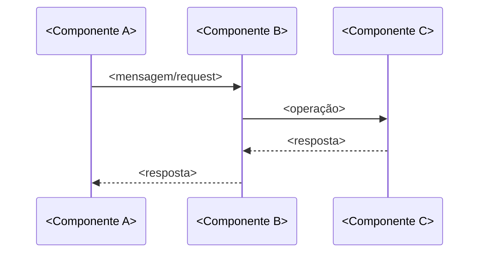

# História: <Título da História>

**ID:** <STORY-NNN>

## 1. Dependências

| Blocked By | Blocks |
| :--- | :--- |
| <STORY-NNN ou -> | <STORY-NNN ou -> |

## 2. Regras Transversais Aplicáveis

> Referência às regras definidas no Épico (seção 4). Listar apenas as regras que impactam esta história.

| ID | Título |
| :--- | :--- |
| <RULE-NNN> | <Título da regra> |

## 3. Descrição

Como **<Persona>**, eu quero <ação/capacidade>, garantindo que <benefício/resultado esperado>.

<Contexto adicional (2-3 parágrafos) explicando o porquê desta história, como ela se encaixa no épico, e quaisquer decisões de design relevantes.>

### 3.1 <Requisito Técnico/Funcional A>

- <Especificação técnica detalhada>
- <Protocolo/formato/constraint>
- <Comportamento esperado>

### 3.N <Requisito Técnico/Funcional N>

- <Especificação>

## 4. Definições de Qualidade Locais

### DoR Local (Definition of Ready)

- [ ] <Pré-condição específica desta história>
- [ ] <Decisão técnica que precisa estar tomada>
- [ ] <Artefato/schema/config que precisa existir>

### DoD Local (Definition of Done)

- [ ] <Critério de aceite implementado e validado>
- [ ] <Componente/handler/endpoint funcional>
- [ ] <Teste específico passando>

### Global Definition of Done (DoD)

> Copiar do Épico. Mantido aqui para referência rápida durante code review.

- **Cobertura:** <Meta de cobertura>
- **Testes Automatizados:** <Tipos de testes exigidos>
- **Relatório de Cobertura:** <Formato>
- **Documentação:** <Artefatos>
- **Persistência:** <Critério>
- **Performance:** <SLO>

## 5. Contratos de Dados (Data Contract)

<Definição dos payloads, schemas, mapas de bits ou contratos relevantes para esta história.>

**<Nome do contrato/protocolo>:**

| Campo | Formato | Request | Response | Origem / Regra |
| :--- | :--- | :--- | :--- | :--- |
| `<campo>` | <tipo formato> | <M/O/-> | <M/O/-> | <Generate/Echo/Derive — descrição> |

## 6. Diagramas

### 6.1 <Nome do Diagrama>



## 7. Critérios de Aceite (Gherkin)

```gherkin
Cenario: <Nome do cenário de sucesso>
  DADO que <pré-condição>
  QUANDO <ação>
  E <condição adicional>
  ENTÃO <resultado esperado>
  E <validação adicional>

Cenario: <Nome do cenário de erro>
  DADO que <pré-condição>
  QUANDO <ação com dados inválidos>
  ENTÃO <comportamento de erro esperado>
  E <validação de integridade>

Cenario: <Nome do cenário de edge case>
  DADO que <condição de borda>
  QUANDO <ação>
  ENTÃO <comportamento esperado>
```

## 8. Sub-tarefas

- [ ] [Dev] <Implementação do componente principal>
- [ ] [Dev] <Implementação de componente secundário>
- [ ] [Test] Unitário: <Escopo do teste unitário>
- [ ] [Test] Integração: <Escopo do teste de integração>
- [ ] [Doc] <Documentação a ser atualizada>
