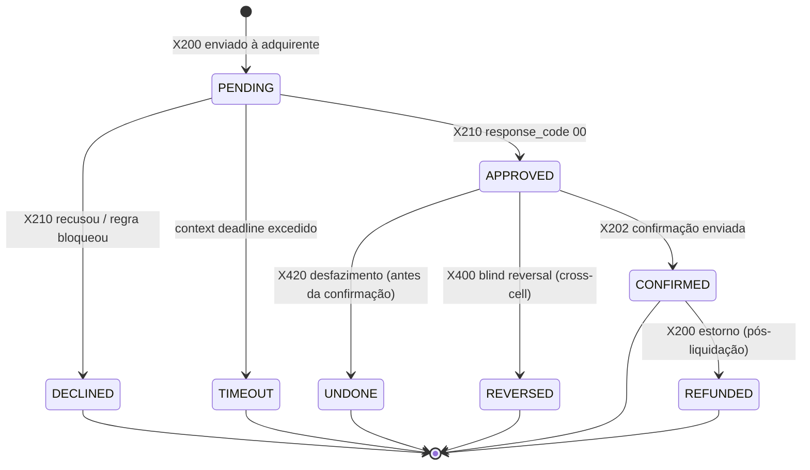
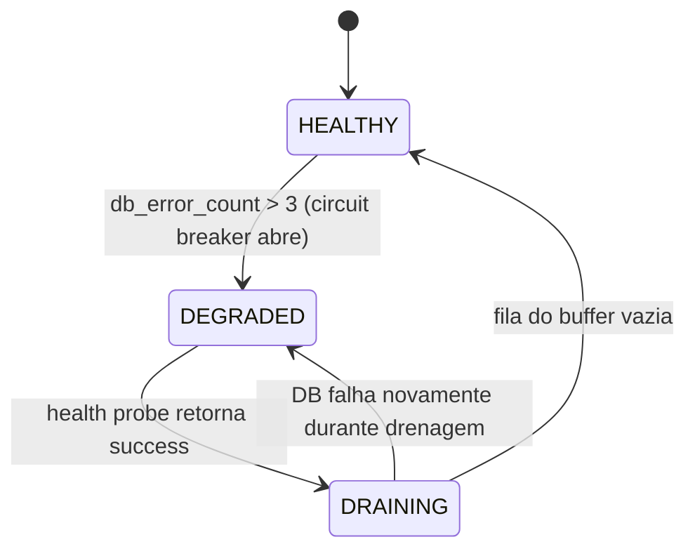

# Huginn — Gateway de Pagamentos

---

## 1. Visão Geral

### Objetivo

Huginn é o gateway transacional da plataforma. Recebe transações de pagamento, resolve o protocolo EMV, roteia para a adquirente correta e retorna a resposta. Stateless por design, com cache L1 in-process e buffer SiP para contingência. Não faz liquidação — opera exclusivamente como gateway.

### Responsabilidades

- Processamento de transações: authorize (por produto: credit, debit, voucher), confirm (X202), undo (desfazimento X420), refund (estorno), reverse (blind reversal X400).
- Módulo de protocolo EMV/BIN/CAPK (`huginn-protocol-module`) — resolve tabelas EMV, valida BIN ranges, gerencia CAPK. Deriva `brand` e `product_type` a partir da tabela de BINs (sem necessidade de envio no payload).
- Routing Rules Engine — seleção de adquirente e validação de negócio via regras declarativas JSON (assinadas pelo [Svalinn](svalinn.md)).
- Cache L1 in-process (Caffeine) com invalidação via eventos Kafka (`MasterDataChanged`) — cachea contexto de merchant/device e regras de roteamento.
- Stand-in Processing (SiP) — buffer em PVC local criptografado para contingência.
- Conexão direta com adquirentes via ISO 8583 / TCP.
- Registro de transações em tabela append-only (`payment_events`) para auditoria. Publicação no Kafka Global para centralização (com fallback local se Kafka indisponível).

### Stack Tecnológico

| Componente           | Tecnologia                       | Detalhes                                                                           |
| :------------------- | :------------------------------- | :--------------------------------------------------------------------------------- |
| **Runtime**          | Java 21 / Quarkus 3.x            | Stateless. Deployment como `huginn-core` dentro de cada Cell.                      |
| **Banco**            | PostgreSQL 16+ (por Cell)        | Instância dedicada gerenciada por CloudNativePG. Tabela `payment_events`.          |
| **Cache L1**         | Caffeine (in-process)            | `max-size: 10000`, `ttl: 30s`. Hot set only (~10-15MB/pod). Invalidado por `MasterDataChanged` via Kafka. |
| **Cache L2**         | Dragonfly (RESP, por Stamp)      | 1 instância compartilhada por Stamp. Cache puro LRU. Proteção de DB contra thundering herd.  |
| **Mensageria**       | Kafka Global (KRaft)             | Publica transações para centralização. Consome eventos de Master Data para invalidação de cache. |
| **Kafka Fallback**   | Tabela `kafka_fallback` (PG Cell) | Buffer local quando Kafka indisponível. Drainer automático reprocessa ao reconectar. |
| **ISO 8583**         | [b8583](https://github.com/bifrost-project/b8583.git) (`com.bifrost:b8583`) | Pack/unpack ISO8583. Suporta ISO 1987/1993/2021 via Dialects configuráveis por adquirente. |
| **Protocolo legado** | ISO 8583 / TCP                    | Comunicação com adquirentes (Cielo, Rede, Stone, etc.). Versão ISO configurável por adquirente (1987=0xxx, 1993=1xxx, 2021=xxx). |
| **SiP buffer**       | PVC local criptografado          | Buffer de contingência em disco. Detalhes de criptografia e sizing na modelagem do Huginn. |

### Padrões Arquiteturais

> Referência: [Padrões Globais](../02-padroes-globais.md)

- **Append-Only Log:** transações registradas em `payment_events` (somente INSERT). Auditoria e rastreabilidade garantidas por RBAC + `idempotency_key`.
- **Locality-Aware:** processamento na região do Home Stamp do Merchant. Sem transações síncronas intercontinentais.
- **Survival Unit:** opera isoladamente com dependências mínimas (PG local + cache).
- **Circuit Breaker:** entre Huginn e conectores ISO8583 (timeouts rígidos) e entre Huginn e PostgreSQL local (ativa SiP quando aberto).
- **Kafka publish + Fallback:** após INSERT no PG, Huginn publica no Kafka Global. Se Kafka falhar, persiste na tabela `kafka_fallback` (PG Cell local). Drainer automático drena `kafka_fallback` quando Kafka retorna.

### Localização

Dentro de cada **Cell** em Stamps Regionais (Nível 3). Deployment: `huginn-core` (stateless, com PVC para SiP buffer).

---

## 2. Regras de Negócio

### 2.1 Transaction State Machine

Cada transação segue uma máquina de estados explícita baseada no modelo **single-message TEF brasileiro** (ciclo de 3 pernas: X200 → X210 → X202). Transições inválidas são rejeitadas pelo domain layer (código Java) antes de qualquer persistência.

> **Convenção de MTI genérico (X-notation):** Este documento usa `X` no lugar do primeiro dígito do MTI para ser agnóstico à versão ISO. A versão real (1987=`0xxx`, 1993=`1xxx`, 2021=`xxx`) é configurada por adquirente via Dialects na b8583. Exemplo: `X200` = `0200` (ISO 1987) = `1200` (ISO 1993) = `200` (ISO 2021).

**Tabela de MTIs por Versão ISO (b8583 Dialects):**

| MTI Genérico | ISO 1987 (0xxx) | ISO 1993 (1xxx) | ISO 2021 (xxx) | Descrição |
| :--- | :--- | :--- | :--- | :--- |
| X200 | 0200 | 1200 | 200 | Financial Transaction Request |
| X210 | 0210 | 1210 | 210 | Financial Transaction Response |
| X202 | 0202 | 1202 | 202 | Financial Transaction Advice (confirmação) |
| X220 | 0220 | 1220 | 220 | Financial Transaction Advice (acquirer) |
| X400 | 0400 | 1400 | 400 | Reversal Request |
| X410 | 0410 | 1410 | 410 | Reversal Response |
| X420 | 0420 | 1420 | 420 | Reversal Advice |
| X430 | 0430 | 1430 | 430 | Reversal Advice Response |

> A versão ISO é configurável por adquirente via Dialects na b8583 (ver documentação do [repositório](https://github.com/bifrost-project/b8583.git)).

**Estados:**

| Estado | Descrição | Terminal? |
| :--- | :--- | :--- |
| `PENDING` | X200 enviada, aguardando X210 da adquirente | Não |
| `APPROVED` | Adquirente aprovou (X210 recebido, `response_code: 00`). Aguardando confirmação X202 | Não |
| `CONFIRMED` | Ciclo completo — X202 enviada. Transação financeiramente efetivada. Elegível para estorno | Sim |
| `DECLINED` | Adquirente recusou ou regra de negócio bloqueou | Sim |
| `TIMEOUT` | Context deadline excedido (default 32s, ver seção 3.1). SDK pode retentar com mesma `idempotency_key` | Sim |
| `UNDONE` | Desfazimento (X420) executado antes da confirmação. Transação anulada | Sim |
| `REVERSED` | Blind reversal (X400) executado via cross-cell failover | Sim |
| `REFUNDED` | Estorno pós-liquidação emitido | Sim |

**Transições válidas:**

| De → Para | Operação | MTI | Condição |
| :--- | :--- | :--- | :--- |
| PENDING → APPROVED | authorize | X200/X210 | Adquirente retorna `response_code: 00` |
| PENDING → DECLINED | authorize | X200/X210 | Adquirente retorna código de recusa, ou regra de validação bloqueia |
| PENDING → TIMEOUT | authorize | X200/— | Context deadline excedido (ver seção 3.1 — Timeout Cascade) |
| APPROVED → CONFIRMED | confirm | X202 | Confirmação enviada após receber X210 com sucesso |
| APPROVED → UNDONE | undo | X420 | Desfazimento antes da confirmação (ex: erro no PDV, falha de impressão) |
| APPROVED → REVERSED | reverse | X400 | Blind reversal cross-cell (SDK detectou timeout na Home Cell) |
| CONFIRMED → REFUNDED | refund | X200/X210 | Estorno pós-liquidação. Valor ≤ valor confirmado |

> **Nota:** Não existe estado `SETTLED`. Liquidação não é responsabilidade do Huginn (gateway puro).
>
> **Ausência de X202 (confirmação):** O comportamento da adquirente quando não recebe a X202 dentro do timeout varia por adquirente: algumas executam auto-reversal (desfazem a transação), outras auto-confirmam (efetivam a transação sem X202). Huginn deve tratar ambos os cenários na reconciliação, consultando o comportamento configurado por adquirente.

### 2.2 Validações de Negócio

| Validação | Fonte de Dados | Resposta se Falhar |
| :--- | :--- | :--- |
| Merchant ativo | Cache L1/L2 → PG | 400 `MERCHANT_INACTIVE` |
| Device provisionado e vinculado ao merchant | Cache L1/L2 → PG | 400 `DEVICE_NOT_FOUND` |
| Brand derivada (BIN/AID) habilitada para o merchant | Routing Rules (VALIDATION) + BIN table | 400 `BRAND_NOT_ALLOWED` |
| Product (endpoint) compatível com BIN `product_type` | BIN table (Cache L1) | 400 `PRODUCT_MISMATCH` |
| Amount ≤ limite configurado (por merchant ou global) | Routing Rules (VALIDATION) | 400 `AMOUNT_EXCEEDS_LIMIT` |
| mTLS cert binding: `merchant_id` no certificado == `merchant_id` no payload | Certificado X.509 | 401 `CERT_MISMATCH` |
| Idempotency: request duplicado | Dragonfly L2 → PG | 200 (retorna resposta cacheada) |
| BIN range válido e habilitado | Cache L1 (tabela BIN) | 400 `BIN_NOT_FOUND` |
| InputMode compatível com capabilities do terminal | `terminal_info.physical_characteristics` | 400 `INPUT_MODE_NOT_SUPPORTED` |
| EMV data presente quando input_mode = CHIP_EMV ou CONTACTLESS_EMV | Payload | 400 `EMV_DATA_REQUIRED` |
| PaymentFacilitator completo se merchant é facilitador | Cache L1 (merchant config) | 400 `FACILITATOR_DATA_REQUIRED` |
| Installments presente apenas em `/credit/authorize` | Endpoint + Payload | 400 `INSTALLMENT_NOT_ALLOWED` |

### 2.3 Campos Derivados

> **Campos derivados (não enviados no request):**
> - `brand` — derivado da tabela de BINs (via `pan_token` detokenizado → BIN range) ou da tag 84 (AID) no `emv_data`. O `huginn-protocol-module` resolve em cache L1.
> - `product` — implícito no endpoint chamado (`/credit/`, `/debit/`, `/voucher/`). Para BINs do tipo `MULTIPLE` (suportam crédito + débito), o SDK (Muninn) apresenta a tela de seleção ao portador e chama o endpoint correto.
> - `product_type` — validado contra a tabela de BINs. Se o endpoint é `/credit/authorize` mas o BIN é puramente débito, retorna 400 `PRODUCT_MISMATCH`.

### 2.4 Routing Rules Engine

Huginn decide para qual adquirente enviar cada transação usando regras declarativas JSON, avaliadas em runtime.

**Tipos de Regras:**

| Tipo | Propósito | Exemplo |
| :--- | :--- | :--- |
| **ROUTING** | Seleção de adquirente | `card.brand == VISA && amount > 10000 → CIELO` |
| **VALIDATION** | Bloqueio por regra de negócio | `amount > max_limit → BLOCK`, `bin IN restricted_list → BLOCK` |

**Contrato da Regra:**

| Campo | Tipo | Descrição |
| :--- | :--- | :--- |
| `rule_id` | VARCHAR | Identificador único da regra |
| `version` | SEMVER | Versionamento semântico |
| `type` | ENUM | `ROUTING` (seleção de adquirente) ou `VALIDATION` (bloqueio) |
| `priority` | INTEGER | Menor = maior prioridade. Primeira match vence |
| `conditions` | ARRAY | Lista de condições com `field` (`card.brand`, `transaction.amount`, etc.), `operator` (`EQUALS`, `GREATER_THAN`, `IN`, `NOT_IN`), `value` |
| `actions` | ARRAY | Lista de ações com `type` (`SET_ACQUIRER`, `BLOCK`), `value` |
| `signature` | STRING | Assinatura ES256 pelo [Svalinn](svalinn.md). Regra com assinatura inválida é rejeitada |

**Pipeline de Avaliação:**

1. **Carregamento:** regras cacheadas no L1, invalidadas via Kafka `MasterDataChanged`.
2. **Verificação de assinatura:** ES256 ([Svalinn](svalinn.md)). Regra com assinatura inválida é rejeitada.
3. **Avaliação:** determinístico, sem sandbox (sem execução de código arbitrário).
4. **Prioridade:** regras ordenadas por `priority` (menor = maior prioridade). Primeira match vence.
5. **Fallback:** se nenhuma regra de ROUTING casar, usa rota default do merchant (configurada no [Vanir](vanir.md)).

**Origem e Publicação:**

- **Source of truth:** [Vanir](vanir.md) (master data) armazena regras.
- **Assinatura:** [Svalinn](svalinn.md) assina após validação (ES256).
- **Distribuição:** publicadas via Kafka (`bifrost.masterdata.changes`), consumidas pelo Huginn para invalidação de cache.

### 2.5 Idempotency

**Contrato:**

- **Header:** `X-Bifrost-Idempotency-Key` (obrigatório em todas as operações)
- **Formato:** UUIDv4 ou string opaca, até 64 caracteres
- **Escopo:** chave única por `merchant_id` (mesmo key de merchants diferentes = transações diferentes)

**Comportamento:**

| Cenário | Ação |
| :--- | :--- |
| Primeira request | Processa normalmente. Cachea resultado no Dragonfly L2 |
| Request duplicada (key já existe no cache) | Retorna resposta cacheada (200 com body original). Sem reprocessamento |
| Request duplicada (cache miss, key existe no PG) | PG UNIQUE constraint previne INSERT. Consulta registro existente e retorna |

**Storage:**

| Camada | Chave | TTL | Propósito |
| :--- | :--- | :--- | :--- |
| Dragonfly L2 | chave composta merchant_id + idempotency_key | 24h | Fast path — evita hit no PG para duplicatas recentes |
| PostgreSQL | `idempotency_key` UNIQUE constraint | Permanente (append-only) | Garantia final — previne duplicata mesmo após cache expirar |

---

## 3. Especificações de Plataforma

### 3.1 Timeouts & Circuit Breakers

**Cadeia de Timeouts (Timeout Cascade)**

Em transações financeiras, cada camada precisa de tempo para receber a resposta da camada abaixo, processar e devolver. O timeout mais curto fica na ponta (adquirente) e cresce em direção ao cliente (Muninn). Isso garante que cada camada receba uma resposta adequada (sucesso, erro ou timeout) da camada inferior, evitando respostas órfãs e reconciliação desnecessária.

| Camada | Timeout | Valor Default | Lógica |
| :--- | :--- | :--- | :--- |
| **Socket Timeout** (Huginn → Adquirente) | T | 30s | Base da cadeia. Tempo máximo que o conector ISO8583/TCP espera resposta da adquirente. Configurável por adquirente |
| **Context Deadline** (Huginn end-to-end) | T + 2s | 32s | Absorve o socket timeout + processamento interno (validações, routing, persistência). Se o socket timeout estourar, Huginn ainda tem margem para registrar o TIMEOUT e responder 504 ao SDK |
| **SDK Timeout** (Muninn → Huginn) | T + 5s | 35s | Absorve o context deadline do Huginn + latência de rede (mTLS handshake, Cell routing). O Muninn sempre recebe uma resposta do Huginn (aprovação, recusa ou timeout) antes de estourar seu próprio timer |

> **Regra fundamental:** `Socket Timeout < Context Deadline < SDK Timeout`. Se essa ordem for invertida, o Huginn pode retornar 504 antes de receber a resposta da adquirente (gerando respostas órfãs) ou o Muninn pode timeout antes do Huginn responder (gerando retentativas desnecessárias).

**Configuração dinâmica dos timeouts:**

O Socket Timeout (T) é configurável por adquirente (cada adquirente pode ter tempos de resposta diferentes). O Context Deadline e o SDK Timeout são derivados de T automaticamente. O Muninn recebe o SDK Timeout como parte da configuração de inicialização distribuída pelo [Vanir](vanir.md) (campo `sdk_timeout_seconds` no contexto do merchant/device), evitando valores hardcoded no SDK.

**Demais Timeouts e Circuit Breakers:**

| Timeout | Valor | Escopo | Comportamento |
| :--- | :--- | :--- | :--- |
| **Circuit Breaker Threshold** | 3 falhas consecutivas | Huginn ↔ PostgreSQL | Ativa SiP mode |
| **Circuit Breaker Half-Open** | 10s | Huginn ↔ PostgreSQL | Probe de health para tentar fechar o circuito |
| **Cache L1 TTL** | 30s | Caffeine (in-process) | Invalidado via Kafka `MasterDataChanged` |
| **Cache L2 TTL** | 3600s | Dragonfly (por Stamp) | LRU eviction |

### 3.2 Retry Logic & Failover (Huginn → Adquirente)

| Tipo de Erro | Retries | Backoff | Ação |
| :--- | :--- | :--- | :--- |
| 5xx / Timeout da adquirente | 2 | Exponencial + jitter | No 3º falha: failover para rota alternativa (se configurada nas Routing Rules) |
| 4xx / Erro lógico (recusa) | 0 | — | Fail fast. Retorna `DECLINED` ao SDK |
| Circuit Breaker aberto | 0 | — | Fail fast. Retorna 502 ao SDK |

**Backoff:** Exponencial com jitter. ~1s no primeiro retry, ~2s no segundo.

**Failover de rota:** se a Routing Rules Engine tiver rota alternativa configurada (`fallback_acquirer`), Huginn tenta a segunda rota após esgotar retries da primeira. Limitado a 1 failover (evita cascata).

### 3.3 Rate Limiting & Backpressure

| Limite | Escopo | Mecanismo | Valor Default |
| :--- | :--- | :--- | :--- |
| TPS por Cell | Infraestrutura | Ingress Controller + K8s HPA | Configurável por Stamp |
| RPS por Merchant | Negócio | Token bucket (Caffeine in-process) | Configurável por merchant (Vanir) |
| Max body size | Segurança | Quarkus config | 64KB |

**Resposta:** `429 Too Many Requests` com header `Retry-After: <seconds>`.

**Backpressure do SiP:** quando SiP buffer atinge 90% de capacidade, Huginn retorna `503 Service Unavailable` (fail fast). Não aceita novas transações em SiP até buffer drenar abaixo de 70%.

### 3.4 Stand-in Processing (SiP)

Quando circuit breaker do PostgreSQL local abre (3 falhas consecutivas):

1. Huginn ativa modo SiP, persiste eventos em PVC local criptografado.
2. Continua respondendo conforme política (aprovar/recusar conservadoramente).
3. Formato: arquivo append-only com registros delimitados, cada um com `idempotency_key`.

**State Machine do SiP:**

**Parâmetros de Drenagem:**

| Parâmetro | Valor | Justificativa |
| :--- | :--- | :--- |
| **Drain rate** | 10 req/s | Protege DB de shock após recovery |
| **Batch size** | 50 registros | Controle de memória |
| **CPU threshold** | 70% | Pausa drenagem se CPU alta — prioriza tráfego live |

**Regras do SiP:**

| Regra | Descrição |
| :--- | :--- |
| Transações em SiP | Apenas `authorize` com valor ≤ limite configurado (limita risco financeiro) |
| Encriptação do buffer | PVC criptografado at-rest (requisito PCI-DSS) |
| Drenagem | Idempotency-based: `idempotency_key` garante exactly-once na reconciliação |
| Backpressure | Buffer > 90% → rejeita novas transações (503). Retoma abaixo de 70% |

### 3.5 Modelo de Dados (`payment_events`)

Tabela append-only (somente INSERT). Registro imutável de todas as operações transacionais.

**Regra de Segurança:** RBAC restrito — role de escrita tem apenas permissão INSERT. Nenhuma role possui UPDATE ou DELETE. Requisito de auditoria e compliance PCI-DSS.

**Campos principais:**

| Campo | Tipo | Obrigatório | Descrição |
| :--- | :--- | :--- | :--- |
| `id` | BIGSERIAL | PK | Identificador sequencial |
| `operation` | VARCHAR(20) | Sim | `authorize`, `confirm`, `undo`, `refund`, `reverse` |
| `status` | VARCHAR(20) | Sim | Estado da transação (conforme state machine seção 2.1): `PENDING`, `APPROVED`, `CONFIRMED`, `DECLINED`, `TIMEOUT`, `UNDONE`, `REVERSED`, `REFUNDED` |
| `idempotency_key` | VARCHAR(64) | Sim (UNIQUE) | Chave de idempotência |
| `merchant_id` | VARCHAR(36) | Sim | Identificador do merchant |
| `device_id` | VARCHAR(36) | Sim | Identificador do device |
| `stamp_id` | VARCHAR(36) | Sim | Stamp onde a transação foi processada |
| `amount` | BIGINT | Sim | Valor em centavos |
| `currency` | VARCHAR(3) | Sim | ISO 4217 (BRL, USD) |
| `product` | VARCHAR(10) | Sim | `credit`, `debit`, `voucher` (derivado do endpoint) |
| `input_mode` | VARCHAR(20) | Sim | Modo de entrada do cartão |
| `brand` | VARCHAR(20) | Sim | Bandeira derivada (BIN table / tag 84 AID) |
| `pan_token` | VARCHAR(64) | Sim | Token do cartão (nunca PAN real) |
| `installments_qty` | INTEGER | Não (default=1) | Número de parcelas |
| `installments_type` | VARCHAR(20) | Condicional | Tipo de parcelamento |
| `authorization_code` | VARCHAR(6) | Condicional | Código de autorização da adquirente (DE38) |
| `nsu_acquirer` | VARCHAR(20) | Condicional | NSU da adquirente |
| `nsu_terminal` | VARCHAR(20) | Condicional | STAN do terminal (DE11) |
| `acquirer_id` | VARCHAR(20) | Condicional | Adquirente roteada |
| `response_code` | VARCHAR(2) | Condicional | Código de resposta ISO8583 (DE39) |
| `is_payment_facilitator` | BOOLEAN | Não (default=false) | Se transação é de facilitador |
| `facilitator_id` | VARCHAR(14) | Condicional | CNPJ do facilitador |
| `sub_merchant_id` | VARCHAR(15) | Condicional | ID do sub-merchant |
| `transit_type` | VARCHAR(20) | Condicional | Tipo de transação transit (NULL se não é transporte) |
| `acquirer_response` | JSONB | Não | Resposta completa da adquirente (inclui EMV response tags) |
| `request_metadata` | JSONB | Não | Terminal info, EMV data hash, routing info (sem dados sensíveis) |
| `created_at` | TIMESTAMPTZ | Sim (auto) | Timestamp de criação |

**Constraints:** `idempotency_key` UNIQUE, `status` CHECK contra valores da state machine.

**Fluxo de Escrita:** INSERT no PG local → Kafka publish → (se Kafka falha) kafka_fallback no PG → drainer automático reprocessa ao reconectar.

### 3.6 Mapeamento ISO8583 (API REST ↔ ISO8583 via b8583)

**Modelo: Single-Message TEF (padrão brasileiro)**

O Bifrost opera no modelo single-message, onde a mensagem X200 já embute autorização e captura financeira em uma única mensagem. O ciclo transacional possui três pernas: **request (X200) → response (X210) → confirmação (X202)**.

**Message Type Indicators (MTI):**

| Operação Bifrost | MTI Request | MTI Response | Descrição |
| :--- | :--- | :--- | :--- |
| authorize | X200 | X210 | Financial transaction request/response (auth+capture single-message) |
| confirm | X202 | — | Advice de confirmação — fecha o ciclo transacional. Sem resposta esperada |
| undo (desfazimento) | X420 | X430 | Reversal advice — desfaz transação antes da liquidação (pré-settlement) |
| refund (estorno) | X200 | X210 | Financial com processing code de estorno (pós-liquidação) |
| reverse (blind) | X400 | X410 | Reversal request — cross-cell failover |

> **Por que single-message?** Padrão TEF brasileiro. As adquirentes (Cielo, Rede, Stone, etc.) operam neste modelo. A X200 já é a transação financeira completa. A X202 (confirmação) fecha o ciclo transacional — sem ela, o comportamento varia por adquirente (auto-reversal ou auto-confirmação após timeout).
>
> **Diferença de X420 vs X400:** A X420 é um reversal advice (store-and-forward, point-to-point, entrega garantida). A X400 é um reversal request (end-to-end, usado apenas no cenário de blind reversal cross-cell).

#### Biblioteca b8583

O Huginn utiliza a biblioteca **b8583** para empacotamento/desempacotamento dos campos ISO8583. A construção dos POJOs anotados e a configuração de dialetos por adquirente devem seguir a documentação da lib.

> **Repositório:** [github.com/bifrost-project/b8583](https://github.com/bifrost-project/b8583.git) — `com.bifrost:b8583`. Suporta ISO 1987/1993/2021 via Dialects configuráveis por adquirente.

#### De→Para: Campo REST (Muninn) → Data Element ISO8583

A tabela abaixo define o mapeamento que o conector ISO8583 do Huginn deve implementar usando a b8583. Cada campo REST recebido do Muninn (ou gerado internamente) corresponde a um Data Element na mensagem ISO enviada à adquirente.

**Campos de Request (Muninn → Huginn → Adquirente):**

| Campo REST (Muninn → Huginn) | DE | Nome ISO8583 | Formato | Notas |
| :--- | :--- | :--- | :--- | :--- |
| `card_data.pan_token` (detokenizado) | 2 | Primary Account Number | LLVAR n..19 | Detokenizado apenas no conector ISO8583 (nunca em log/PG) |
| (gerado pelo conector) | 3 | Processing Code | n 6 | `003000`=crédito à vista, `003800`=parcelado lojista, `003900`=parcelado emissor, `002000`=débito/voucher, `200000`=refund |
| `amount` | 4 | Transaction Amount | n 12 | Centavos → 12 dígitos leading zeros |
| (gerado) | 7 | Transmission Date/Time | n 10 | MMDDHHmmss (UTC) |
| (gerado — STAN) | 11 | Systems Trace Audit Number | n 6 | Sequencial por conector. Persiste como `nsu_terminal` |
| (gerado) | 12 | Time, Local Transaction | n 6 | HHmmss |
| (gerado) | 13 | Date, Local Transaction | n 4 | MMDD |
| `card_data.expiration_date` | 14 | Date, Expiration | n 4 | YYMM |
| `card_data.input_mode` | 22 | POS Entry Mode | n 3 | `051`=chip, `071`=contactless, `021`=mag, `012`=typed, `801`=fallback |
| `card_data.pan_sequence_number` | 23 | Card Sequence Number | n 3 | Tag EMV 5F34 |
| `terminal_info.authentication_method` | 26 | POS PIN Capture Code | n 2 | `04`=4 dígitos, `06`=6 dígitos, `12`=12 dígitos |
| `card_data.track2_equivalent` | 35 | Track 2 Data | LLVAR z..37 | Detokenizado no conector |
| (gerado — RRN) | 37 | Retrieval Reference Number | an 12 | Referência de recuperação |
| `terminal_info.terminal_id` | 41 | Card Acceptor Terminal ID | ans 8 | TID de 8 caracteres |
| `merchant_id` | 42 | Card Acceptor ID Code | ans 15 | Código do merchant na adquirente |
| `sub_merchant.*` / merchant data | 43 | Card Acceptor Name/Location | ans 40 | Campo composto posicional: nome (25) + cidade (13) + estado (2) + país (2) |
| `payment_facilitator.*` (MC) | 48 | Additional Data (Private) | LLLVAR | Campo composto TLV: SE26=facilitator_id (Mastercard), SE33=sub_merchant (Mastercard) |
| `currency` | 49 | Currency Code, Transaction | n 3 | ISO 4217 numérico: `986`=BRL, `840`=USD |
| `card_data.pin_block.encrypted_pin_block` | 52 | PIN Data | b 8 | 8 bytes criptografados (DUKPT 3DES ou AES) |
| `card_data.emv_data` | 55 | ICC System Related Data | LLLVAR | Campo composto BER-TLV com todas as tags EMV (ver seção 4.7) |
| `payment_facilitator.*` (Visa) | 62/63 | Private Data | LLLVAR | Campo composto TLV: dados de facilitador (formato Visa) |

**Campos de Response (Adquirente → Huginn → Muninn):**

| DE | Nome ISO8583 | Campo REST (Huginn → Muninn) | Notas |
| :--- | :--- | :--- | :--- |
| 38 | Authorization ID Response | `authorization_code` | an 6 |
| 39 | Response Code | `response_code` | `00`=aprovado, `05`=recusado, `51`=saldo insuficiente |
| 55 | ICC System Related Data | `emv_response` (tags 91, 8A, 71, 72) | ARPC + scripts do emissor (ver seção 4.7) |

> **Segurança:** A detokenização do PAN (DE2) e Track2 (DE35) acontece **exclusivamente** dentro do conector ISO8583, que opera em ambiente PCI DSS. O PAN nunca é exposto em logs, cache, ou na tabela `payment_events`.

### 3.7 Tabelas EMV no Huginn (Cache de BINs)

As tabelas EMV (AID, CAPK, BIN) são gerenciadas pelo [Vanir](vanir.md#tabelas-emv-aid-capk-bin) e distribuídas ao terminal pelo [Muninn](muninn.md#carga-de-tabelas-emv-inicialização-do-terminal). O Huginn consome apenas a tabela de BINs via cache L1.

O `huginn-protocol-module` mantém uma cópia da tabela de BINs (gerenciada pelo [Vanir](vanir.md#tabela-de-bins-bank-identification-numbers)) no cache L1 (Caffeine). Esta cópia é usada para derivar `brand`, validar `product` e determinar capacidades do BIN para roteamento.

> **Source of truth:** A definição completa da tabela de BINs (10 campos) está no [Vanir](vanir.md#tabela-de-bins-bank-identification-numbers). Invalidação via Kafka `MasterDataChanged`. Tabelas de AIDs e CAPKs também no [Vanir](vanir.md#tabelas-emv-aid-capk-bin).

### 3.8 Métricas e Alertas

**Métricas Técnicas (Infraestrutura):**

| Métrica | Warning | Critical | Ação |
| :--- | :--- | :--- | :--- |
| `huginn_authorize_duration_seconds{q="0.99"}` | > 150ms | > 200ms | Investigar cache miss rate, DB latency, network |
| `up{job="huginn"}` + blackbox probe | < 99.99% (5m) | < 99.95% (5m) | Verificar pods, readiness probes, DB health |
| `rate(huginn_requests_total{status=~"5.."}[5m])` | > 1% | > 5% | Verificar logs, circuit breakers, DB errors |
| `huginn_sip_active{stamp="*"}` | = 1 | = 1 por > 5min | DB down. Verificar PostgreSQL health |
| `huginn_sip_buffer_bytes / capacity` | > 70% | > 90% | Buffer quase cheio. DB precisa voltar urgente |

**Métricas de Negócio:**

| Métrica | Tipo | Descrição |
| :--- | :--- | :--- |
| `huginn_approval_rate` | Gauge | Taxa de aprovação (window 5min). KPI primário |
| `huginn_volume_cents_total` | Counter | Volume financeiro processado (centavos) |
| `huginn_timeout_total` | Counter | Transações que atingiram context deadline (504) |
| `huginn_emv_input_mode_total` | Counter | Transações por input_mode (labels: mode, brand) |
| `huginn_installments_total` | Counter | Transações parceladas (labels: type, quantity_bucket) |
| `huginn_facilitator_total` | Counter | Transações de facilitadores (labels: facilitator_id) |
| `huginn_transit_total` | Counter | Transações de transporte (labels: mode, txn_type) |

---

## 4. Contratos de Dados (Referência)

### 4.1 CardData

| Campo | Tipo | Obrigatório | Descrição |
| :--- | :--- | :--- | :--- |
| `input_mode` | ENUM | Sim | `CHIP_EMV`, `CONTACTLESS_EMV`, `MAGNETIC_STRIPE`, `TYPED`, `FALLBACK_MAGNETIC` |
| `pan_token` | VARCHAR(64) | Sim | Token do cartão. Nunca PAN real. Gerado pelo [Svalinn](svalinn.md) ou vault externo |
| `expiration_date` | VARCHAR(4) | Sim (typed/mag) | Formato MMYY |
| `pan_sequence_number` | VARCHAR(3) | Condicional | Diferencia cartões com mesmo PAN (tag EMV 5F34). Obrigatório em CHIP_EMV |
| `service_code` | VARCHAR(3) | Condicional | 3 dígitos do Service Code (tarja magnética). Obrigatório em MAGNETIC_STRIPE e FALLBACK_MAGNETIC |
| `track2_equivalent` | VARCHAR(37) | Condicional | Track 2 data tokenizada. Obrigatório em MAGNETIC_STRIPE e FALLBACK_MAGNETIC |
| `emv_data` | HEX STRING | Condicional | TLV hex string com dados EMV. Obrigatório em CHIP_EMV e CONTACTLESS_EMV. Mapeado para DE55 |
| `pin_block` | OBJECT | Condicional | Bloco de PIN criptografado. Obrigatório quando `authentication_method` = `ONLINE_PIN` |
| `security_code_status` | ENUM | Condicional | `PROVIDED`, `UNREADABLE`, `NOT_PRESENT`. Obrigatório em TYPED |

**Sub-objeto `pin_block`:**

| Campo | Tipo | Obrigatório | Descrição |
| :--- | :--- | :--- | :--- |
| `encrypted_pin_block` | HEX STRING (16 chars) | Sim | PIN criptografado conforme ISO 9564 (Format 0 ou Format 4) |
| `encryption_type` | ENUM | Sim | `DUKPT_3DES` (legado), `DUKPT_AES` (preferencial) |
| `ksn` | HEX STRING (20 chars) | Sim | Key Serial Number — identifica a chave derivada DUKPT |

### 4.2 TerminalInfo

| Campo | Tipo | Obrigatório | Descrição |
| :--- | :--- | :--- | :--- |
| `terminal_id` | VARCHAR(8) | Sim | Identificador lógico do terminal (TID). Registrado no [Vanir](vanir.md). Mapeado para DE41 |
| `serial_number` | VARCHAR(20) | Sim | Número de série físico do PinPad |
| `physical_characteristics` | ENUM | Sim | Capacidades do hardware do terminal |
| `authentication_method` | ENUM | Sim | Resultado de CVM: `NO_PASSWORD`, `ONLINE_PIN`, `OFFLINE_PIN` |
| `return_data_info` | VARCHAR(256) | Não | Retorno de `PP_GetInfo()` da biblioteca compartilhada |

**Valores de `physical_characteristics`:** `PINPAD_CHIP`, `PINPAD_CHIP_SAM`, `PINPAD_CHIP_CONTACTLESS`, `PINPAD_CHIP_SAM_CONTACTLESS`, `MPOS_CHIP`, `MPOS_CHIP_CONTACTLESS`.

### 4.3 PaymentFacilitator

| Campo | Tipo | Obrigatório | Descrição | ISO8583 |
| :--- | :--- | :--- | :--- | :--- |
| `facilitator_id` | VARCHAR(11) | Sim | CNPJ do facilitador | DE48-SE26 (MC) / DE63 (Visa) |
| `sub_merchant.id` | VARCHAR(15) | Sim | ID do sub-merchant | DE48-SE33 (MC) / DE63 (Visa) |
| `sub_merchant.name` | VARCHAR(22) | Sim | Nome do sub-merchant | DE43 |
| `sub_merchant.mcc` | VARCHAR(4) | Sim | MCC do sub-merchant (ISO 18245) | DE18 |
| `sub_merchant.address` | VARCHAR(48) | Sim | Endereço | DE43 |
| `sub_merchant.city` | VARCHAR(13) | Sim | Cidade | DE43 |
| `sub_merchant.state` | VARCHAR(2) | Sim | UF | DE43 |
| `sub_merchant.country_code` | VARCHAR(3) | Sim | Código do país (ISO 3166) | DE43 |
| `sub_merchant.postal_code` | VARCHAR(9) | Sim | CEP | DE43 |
| `sub_merchant.phone` | VARCHAR(13) | Não | Telefone | — |
| `sub_merchant.tax_id` | VARCHAR(14) | Sim | CNPJ/CPF (obrigatório BACEN — Circular 3.886) | DE48 |
| `soft_descriptor` | VARCHAR(13) | Sim | Texto na fatura do portador | DE43 |

### 4.4 Installments

| Campo | Tipo | Obrigatório | Descrição |
| :--- | :--- | :--- | :--- |
| `quantity` | INTEGER | Não (default=1) | Número de parcelas (1–99). `1` = à vista |
| `type` | ENUM | Condicional | `NO_INSTALLMENT`, `MERCHANT_INSTALLMENT`, `ISSUER_INSTALLMENT`. Obrigatório se `quantity` > 1 |
| `first_amount` | BIGINT | Não | Valor da primeira parcela (centavos) |
| `interest` | ENUM | Condicional | `WITHOUT_INTEREST`, `WITH_INTEREST`. Obrigatório se `quantity` > 1 |

**Mapeamento ISO8583:** `NO_INSTALLMENT` → DE3 `003000`, `MERCHANT_INSTALLMENT` → DE3 `003800`, `ISSUER_INSTALLMENT` → DE3 `003900`.

### 4.5 Transit

| Campo | Tipo | Obrigatório | Descrição |
| :--- | :--- | :--- | :--- |
| `transportation_mode` | ENUM | Sim | `BUS`, `METRO`, `RAIL`, `FERRY`, `TRAM`, `PARKING`, `TOLL` |
| `transaction_type` | ENUM | Sim | `TAP_IN`, `TAP_OUT`, `AGGREGATED`, `DEBT_RECOVERY`, `FULL_FARE` |
| `deferred_authorization` | BOOLEAN | Não (default=false) | Se true, autorização diferida |
| `aggregation_id` | VARCHAR(36) | Condicional | ID do período de agregação. Obrigatório se `AGGREGATED` |
| `debt_recovery_original_id` | VARCHAR(36) | Condicional | Referência à transação original. Obrigatório se `DEBT_RECOVERY` |
| `route_id` | VARCHAR(20) | Não | Identificador da rota/linha |

### 4.6 InputMode

| Modo | Campos Obrigatórios | DE22 (ISO8583) | Descrição |
| :--- | :--- | :--- | :--- |
| `CHIP_EMV` | `emv_data`, `pin_block` (se CVM=online PIN), `pan_sequence_number` | 051 | Chip contact |
| `CONTACTLESS_EMV` | `emv_data`, opcionalmente `pin_block` | 071 | Tap contactless |
| `MAGNETIC_STRIPE` | `track2_equivalent`, `service_code` | 021 | Swipe de tarja magnética |
| `TYPED` | `pan_token`, `expiration_date`, `security_code_status` | 012 | Digitação manual |
| `FALLBACK_MAGNETIC` | `track2_equivalent`, `service_code` | 801 | Fallback de chip para tarja |

> **Fluxos de leitura EMV:** documentados no [Muninn](muninn.md#fluxo-de-leitura-emv-chip_emv).

### 4.7 EMV Tags

**Tags de Request (Terminal → Huginn → Adquirente):**

| Tag | Nome | Len (bytes) | Descrição | Origem |
| :--- | :--- | :--- | :--- | :--- |
| 9F26 | Application Cryptogram | 8 | ARQC/TC/AAC gerado pelo chip | Card |
| 9F27 | Cryptogram Information Data | 1 | Tipo: `80`=ARQC, `40`=TC, `00`=AAC | Card |
| 9F10 | Issuer Application Data | var | CVR + dados proprietários do emissor | Card |
| 9F37 | Unpredictable Number | 4 | Anti-replay | Terminal |
| 9F36 | Application Transaction Counter | 2 | Contador incremental do chip | Card |
| 9F33 | Terminal Capabilities | 3 | Bitmap de capacidades | Terminal |
| 9F34 | CVM Results | 3 | Resultado da verificação | Terminal |
| 9F35 | Terminal Type | 1 | `22`=attended POS, `23`=unattended | Terminal |
| 9F1A | Terminal Country Code | 2 | ISO 3166 numérico | Terminal |
| 5F2A | Transaction Currency Code | 2 | ISO 4217 numérico | Terminal |
| 9A | Transaction Date | 3 | YYMMDD | Terminal |
| 9C | Transaction Type | 1 | `00`=purchase, `20`=refund | Terminal |
| 9F02 | Amount, Authorized | 6 | Centavos (BCD) | Terminal |
| 9F03 | Amount, Other | 6 | Cashback (BCD) | Terminal |
| 82 | AIP | 2 | Capacidades da aplicação | Card |
| 84 | AID | 5-16 | Application Identifier selecionado | Card |
| 95 | TVR | 5 | Resultado das verificações | Terminal |
| 9B | TSI | 2 | Etapas executadas | Terminal |
| 5F34 | PAN Sequence Number | 1 | Diferenciador de cartões | Card |

**Tags de Resposta (Adquirente → Huginn → Terminal):**

| Tag | Nome | Descrição |
| :--- | :--- | :--- |
| 91 | Issuer Authentication Data | ARPC. Terminal usa para EXTERNAL AUTHENTICATE |
| 8A | Authorization Response Code | `00`=aprovado, `05`=recusado |
| 71 | Issuer Script Template 1 | Scripts ANTES do 2nd Generate AC |
| 72 | Issuer Script Template 2 | Scripts DEPOIS do 2nd Generate AC |
| 89 | Authorization Code | Código alfanumérico (6 chars) |

### 4.8 Response Schema e Error Codes

**Campos do Response (autorização):**

| Campo | Tipo | Presença | Descrição |
| :--- | :--- | :--- | :--- |
| `status` | ENUM | Sempre | Estado resultante: `APPROVED`, `DECLINED`, `TIMEOUT` |
| `authorization_code` | VARCHAR(6) | Se aprovado | Código de autorização da adquirente (DE38) |
| `response_code` | VARCHAR(2) | Sempre | Código ISO8583 (DE39). `00`=aprovado, `05`=recusado, `51`=saldo insuficiente |
| `response_message` | STRING | Sempre | Descrição legível do resultado |
| `nsu_acquirer` | VARCHAR(20) | Se aprovado | NSU da adquirente |
| `nsu_terminal` | VARCHAR(20) | Se aprovado | STAN do terminal (DE11) |
| `idempotency_key` | VARCHAR(64) | Sempre | Eco da chave enviada no request |
| `trace_id` | STRING | Sempre | W3C Trace ID para rastreabilidade distribuída |
| `brand` | VARCHAR(20) | Sempre | Bandeira derivada pelo Huginn (não enviada no request) |
| `product` | VARCHAR(10) | Sempre | Produto derivado do endpoint (não enviado no request) |
| `input_mode` | VARCHAR(20) | Sempre | Eco do modo de entrada |
| `acquirer_id` | VARCHAR(20) | Se aprovado | Adquirente que processou |
| `installments` | OBJECT | Se parcelado | Eco de `quantity` e `type` |
| `emv_response` | OBJECT | Se EMV | Sub-objeto com tags de resposta EMV |

**Sub-objeto `emv_response`:**

| Campo | Tipo | Descrição |
| :--- | :--- | :--- |
| `issuer_authentication_data` | HEX STRING | ARPC (tag 91). Terminal usa para EXTERNAL AUTHENTICATE |
| `authorization_response_code` | HEX STRING | Tag 8A. `3030`=aprovado |
| `issuer_script_1` | HEX STRING | Tag 71. Scripts ANTES do 2nd Generate AC |
| `issuer_script_2` | HEX STRING | Tag 72. Scripts DEPOIS do 2nd Generate AC |

> `brand` e `product` aparecem no response (derivados pelo Huginn), mas não são enviados no request.

**Campos do Response (pós-autorização — undo, refund, reverse):**

| Campo | Tipo | Presença | Descrição |
| :--- | :--- | :--- | :--- |
| `status` | ENUM | Sempre | Estado resultante: `UNDONE`, `REFUNDED`, `REVERSED` |
| `authorization_code` | VARCHAR(6) | Se disponível | Código de autorização original |
| `response_code` | VARCHAR(2) | Sempre | Código ISO8583 |
| `response_message` | STRING | Sempre | Descrição legível |
| `nsu_acquirer` | VARCHAR(20) | Sempre | NSU da operação |
| `idempotency_key` | VARCHAR(64) | Sempre | Chave da operação atual |
| `original_idempotency_key` | VARCHAR(64) | Sempre | Chave da autorização original |
| `amount` | BIGINT | Se aplicável | Valor da operação (refund) |

**Error codes:**

| HTTP | Cenário | Código no body | Ação do SDK |
| :--- | :--- | :--- | :--- |
| 200 | Sucesso (aprovado ou recusado) | `APPROVED`, `DECLINED` | Exibe resultado. Se `APPROVED`, SDK sinaliza conclusão para Huginn enviar X202 |
| 400 | Request inválido | `MERCHANT_INACTIVE`, `DEVICE_NOT_FOUND`, `BRAND_NOT_ALLOWED`, `PRODUCT_MISMATCH`, `AMOUNT_EXCEEDS_LIMIT`, `BIN_NOT_FOUND`, `INPUT_MODE_NOT_SUPPORTED`, `EMV_DATA_REQUIRED`, `FACILITATOR_DATA_REQUIRED`, `INSTALLMENT_NOT_ALLOWED` | Corrigir payload |
| 401 | mTLS inválido | `CERT_MISMATCH` | Renovar certificado via [Svalinn](svalinn.md) |
| 429 | Rate limit excedido | — | Retentar após `Retry-After` |
| 500 | Erro interno | `ERROR` | Retentar com mesma `idempotency_key` |
| 502 | Adquirente inalcançável | `ERROR` | Retentar ou failover de Cell |
| 503 | SiP backpressure | — | Failover para Spare Cell |
| 504 | Context deadline excedido | `TIMEOUT` | Retentar com mesma `idempotency_key` |

---

## 5. Jornadas Transacionais

### 5.1 — Autorização Crédito à Vista

**Endpoint:** `POST /api/v1/credit/authorize`
**MTI ISO8583:** X200 / X210 (single-message) + X202 (confirmação)
**Transição de estado:** PENDING → APPROVED / DECLINED / TIMEOUT → CONFIRMED (após X202)

#### Pré-condições
- Merchant ativo e device provisionado (cache L1/L2)
- BIN do cartão com `product_type` = `CREDIT` ou `MULTIPLE`
- Tabelas EMV carregadas no terminal (se CHIP_EMV/CONTACTLESS_EMV)

#### Regras de Negócio Aplicáveis
- Todas as validações da seção 2.2
- `installments` ausente ou `quantity=1` (à vista)
- Se `installments` presente com `quantity>1`, ver Jornada 5.2

#### Campos Obrigatórios
`merchant_id`, `device_id`, `idempotency_key`, `amount` (> 0), `currency`, `card_data` (completo conforme InputMode), `terminal_info`

#### Campos Derivados
- `brand` → BIN table / tag 84. `product` = `credit` (endpoint). DE3 = `003000` (crédito à vista)

#### Mapeamento ISO8583 Relevante
MTI X200/X210 (single-message). DE3=`003000` (crédito à vista), DE22=`051` (chip), DE52=PIN Data, DE55=EMV TLV. Após X210 aprovado, Huginn envia X202 (confirmação).

#### Cenários de Erro

| Cenário | HTTP | Código |
| :--- | :--- | :--- |
| BIN é puramente débito | 400 | `PRODUCT_MISMATCH` |
| EMV data ausente com CHIP_EMV | 400 | `EMV_DATA_REQUIRED` |
| Adquirente recusa | 200 | `DECLINED` |

---

### 5.2 — Autorização Crédito Parcelado

**Endpoint:** `POST /api/v1/credit/authorize`
**MTI ISO8583:** X200 / X210 (single-message) + X202 (confirmação)
**Transição de estado:** PENDING → APPROVED / DECLINED / TIMEOUT → CONFIRMED (após X202)

#### Pré-condições
- Mesmas de 5.1
- Merchant com parcelamento habilitado (max_installments > 1 no [Vanir](vanir.md))

#### Regras de Negócio Aplicáveis
- Todas as validações de 2.2
- `installments.quantity` > 1, `type` e `interest` obrigatórios
- Quantidade máxima: configurável por merchant (default global: 12)
- Valor mínimo por parcela: configurável por merchant (default global: R$ 5,00 / 500 centavos)

#### Campos Obrigatórios Adicionais
`installments.quantity`, `installments.type`, `installments.interest`

#### Campos Derivados
- DE3 = `003800` (parcelado lojista) ou `003900` (parcelado emissor)

#### Mapeamento ISO8583 Relevante
MTI X200/X210 (single-message). DE3=`003800` (parcelado lojista) ou `003900` (parcelado emissor), DE22=`051` (chip), DE48 SE14=quantidade parcelas, DE52=PIN Data, DE55=EMV TLV. Após X210 aprovado, Huginn envia X202 (confirmação)

#### Cenários de Erro

| Cenário | HTTP | Código |
| :--- | :--- | :--- |
| BIN é puramente débito | 400 | `PRODUCT_MISMATCH` |
| EMV data ausente com CHIP_EMV | 400 | `EMV_DATA_REQUIRED` |
| Quantity > max_installments do merchant | 400 | `AMOUNT_EXCEEDS_LIMIT` |
| Valor por parcela < mínimo | 400 | `AMOUNT_EXCEEDS_LIMIT` |
| `installments.type` ausente | 400 | `MISSING_REQUIRED_FIELD` |
| Adquirente recusa | 200 | `DECLINED` |

---

### 5.3 — Autorização Crédito — Sub-Adquirente (Facilitador)

**Endpoint:** `POST /api/v1/credit/authorize`
**MTI ISO8583:** X200 / X210 (single-message) + X202 (confirmação)
**Transição de estado:** PENDING → APPROVED / DECLINED / TIMEOUT → CONFIRMED (após X202)

#### Pré-condições
- Merchant cadastrado como facilitador no [Vanir](vanir.md) (`is_payment_facilitator=true`)
- Sub-merchant registrado com dados completos

#### Regras de Negócio Aplicáveis
- Todas de 2.2 + `FACILITATOR_DATA_REQUIRED`
- Campos de `payment_facilitator` obrigatórios por regulamentação Visa/Mastercard/BACEN
- `soft_descriptor` truncado a 13 chars, concatenado com nome do facilitador no DE43

#### Campos Obrigatórios Adicionais
Todos os campos de `payment_facilitator` (ver seção 4.3)

#### Campos Derivados
- `brand` → BIN table / tag 84. `product` = `credit` (endpoint). DE3 conforme installments (ver 5.1/5.2)

#### Mapeamento ISO8583 Relevante
MTI X200/X210 (single-message). DE3=`003000` (crédito à vista) ou `003800`/`003900` (parcelado), DE22=`051` (chip), DE43=nome/endereço sub-merchant formatado, DE48 SE26=facilitator_id (Mastercard), SE33=sub_merchant (Mastercard), DE52=PIN Data, DE55=EMV TLV, DE62/63=dados facilitador (formato Visa). Após X210 aprovado, Huginn envia X202 (confirmação)

#### Cenários de Erro

| Cenário | HTTP | Código |
| :--- | :--- | :--- |
| BIN é puramente débito | 400 | `PRODUCT_MISMATCH` |
| Merchant é facilitador mas `payment_facilitator` ausente | 400 | `FACILITATOR_DATA_REQUIRED` |
| `sub_merchant.tax_id` ausente | 400 | `FACILITATOR_DATA_REQUIRED` |
| `sub_merchant.mcc` inválido | 400 | `FACILITATOR_DATA_REQUIRED` |
| EMV data ausente com CHIP_EMV | 400 | `EMV_DATA_REQUIRED` |
| Adquirente recusa | 200 | `DECLINED` |

---

### 5.4 — Autorização Débito

**Endpoint:** `POST /api/v1/debit/authorize`
**MTI ISO8583:** X200 / X210 (single-message) + X202 (confirmação)
**Transição de estado:** PENDING → APPROVED / DECLINED / TIMEOUT → CONFIRMED (após X202)

#### Pré-condições
- BIN com `product_type` = `DEBIT` ou `MULTIPLE`
- Sem `installments` (débito não parcela)

#### Regras de Negócio Aplicáveis
- Todas de 2.2
- Se `installments` presente → 400 `INSTALLMENT_NOT_ALLOWED`
- Input: CHIP_EMV ou CONTACTLESS_EMV (débito normalmente requer chip/contactless)

#### Campos Obrigatórios
`merchant_id`, `device_id`, `idempotency_key`, `amount` (> 0), `currency`, `card_data` (completo conforme InputMode), `terminal_info`

#### Campos Derivados
- `brand` → BIN table / tag 84. `product` = `debit` (endpoint). DE3 = `002000` (débito)

#### Mapeamento ISO8583 Relevante
MTI X200/X210 (single-message). DE3=`002000` (débito), DE22=`071` (contactless), DE55=EMV TLV. Nota: débito contactless sem PIN → DE52 ausente. Após X210 aprovado, Huginn envia X202 (confirmação)

#### Cenários de Erro

| Cenário | HTTP | Código |
| :--- | :--- | :--- |
| BIN é puramente crédito | 400 | `PRODUCT_MISMATCH` |
| `installments` enviado | 400 | `INSTALLMENT_NOT_ALLOWED` |
| EMV data ausente | 400 | `EMV_DATA_REQUIRED` |
| Adquirente recusa | 200 | `DECLINED` |

---

### 5.5 — Autorização Débito — Sub-Adquirente (Facilitador)

**Endpoint:** `POST /api/v1/debit/authorize`
**MTI ISO8583:** X200 / X210 (single-message) + X202 (confirmação)
**Transição de estado:** PENDING → APPROVED / DECLINED / TIMEOUT → CONFIRMED (após X202)

#### Pré-condições
- BIN com `product_type` = `DEBIT` ou `MULTIPLE`
- Sem `installments` (débito não parcela)
- Merchant cadastrado como facilitador no [Vanir](vanir.md) (`is_payment_facilitator=true`)
- Sub-merchant registrado com dados completos

#### Regras de Negócio Aplicáveis
- Todas de 2.2
- Se `installments` presente → 400 `INSTALLMENT_NOT_ALLOWED`
- `FACILITATOR_DATA_REQUIRED` — campos de `payment_facilitator` obrigatórios (ver seção 4.3)
- `soft_descriptor` truncado a 13 chars, concatenado com nome do facilitador no DE43

#### Campos Obrigatórios
`merchant_id`, `device_id`, `idempotency_key`, `amount` (> 0), `currency`, `card_data`, `terminal_info`, `payment_facilitator` (completo conforme seção 4.3)

#### Campos Derivados
- `brand` → BIN table / tag 84. `product` = `debit` (endpoint). DE3 = `002000` (débito)

#### Mapeamento ISO8583 Relevante
MTI X200/X210 (single-message). DE3=`002000` (débito), DE22=`071` (contactless), DE43=nome/endereço sub-merchant formatado, DE48 SE26=facilitator_id (Mastercard), SE33=sub_merchant (Mastercard), DE55=EMV TLV, DE62/63=dados facilitador (formato Visa). Após X210 aprovado, Huginn envia X202 (confirmação)

#### Cenários de Erro

| Cenário | HTTP | Código |
| :--- | :--- | :--- |
| BIN é puramente crédito | 400 | `PRODUCT_MISMATCH` |
| `installments` enviado | 400 | `INSTALLMENT_NOT_ALLOWED` |
| Merchant é facilitador mas `payment_facilitator` ausente | 400 | `FACILITATOR_DATA_REQUIRED` |
| `sub_merchant.tax_id` ausente | 400 | `FACILITATOR_DATA_REQUIRED` |
| EMV data ausente | 400 | `EMV_DATA_REQUIRED` |
| Adquirente recusa | 200 | `DECLINED` |

---

### 5.6 — Autorização Voucher

**Endpoint:** `POST /api/v1/voucher/authorize`
**MTI ISO8583:** X200 / X210 (single-message) + X202 (confirmação)
**Transição de estado:** PENDING → APPROVED / DECLINED / TIMEOUT → CONFIRMED (após X202)

#### Pré-condições
- BIN com `product_type` = `VOUCHER`
- Sem `installments` (voucher não parcela)

#### Regras de Negócio Aplicáveis
- Todas de 2.2
- `installments` proibido → 400 `INSTALLMENT_NOT_ALLOWED`
- BIN `product_type` deve ser `VOUCHER`

#### Campos Obrigatórios
`merchant_id`, `device_id`, `idempotency_key`, `amount` (> 0), `currency`, `card_data` (completo conforme InputMode), `terminal_info`

#### Campos Derivados
- `brand` → BIN table / tag 84. `product` = `voucher` (endpoint). DE3 = `002000` (voucher usa mesmo processing code de débito)

#### Mapeamento ISO8583 Relevante
MTI X200/X210 (single-message). DE3=`002000`, DE22=`051` (chip), DE52=PIN Data, DE55=EMV TLV. Nota: voucher usa rede específica da bandeira (Alelo, Sodexo, VR, etc.). Após X210 aprovado, Huginn envia X202 (confirmação)

#### Cenários de Erro

| Cenário | HTTP | Código |
| :--- | :--- | :--- |
| BIN não é VOUCHER | 400 | `PRODUCT_MISMATCH` |
| `installments` enviado | 400 | `INSTALLMENT_NOT_ALLOWED` |
| EMV data ausente com CHIP_EMV | 400 | `EMV_DATA_REQUIRED` |
| Saldo insuficiente (voucher) | 200 | `DECLINED` |
| Adquirente recusa | 200 | `DECLINED` |

---

### 5.7 — Autorização Transit — TAP_IN (Débito Contactless)

**Endpoint:** `POST /api/v1/debit/authorize`
**MTI ISO8583:** X200 / X210 (single-message) + X202 (confirmação)
**Transição de estado:** PENDING → APPROVED / DECLINED / TIMEOUT → CONFIRMED (após X202)

#### Pré-condições
- Merchant com MCC 4111 (transporte urbano) ou 4112 (ferroviário)
- Terminal não-atendido (validador de transporte)
- Contactless obrigatório

#### Regras de Negócio Aplicáveis
- Todas de 2.2
- `amount` = 0 (autorização diferida — valor nominal no tap)
- `input_mode` deve ser `CONTACTLESS_EMV`
- `authentication_method` = `NO_PASSWORD` (terminal não-atendido)
- `transit.transaction_type` = `TAP_IN`
- `transit.deferred_authorization` = true

#### Campos Obrigatórios Adicionais
`transit.transportation_mode`, `transit.transaction_type`, `transit.deferred_authorization`

#### Campos Derivados
- `brand` → BIN table / tag 84. `product` = `debit` (endpoint). DE3 = `002000` (débito)

#### Mapeamento ISO8583 Relevante
MTI X200/X210 (single-message). DE3=`002000` (débito), DE22=`071` (contactless), DE4=`000000000000` (amount=0, diferido), DE55=EMV TLV, DE60=flag de autorização diferida transit. Após X210 aprovado, Huginn envia X202 (confirmação)

#### Cenários de Erro

| Cenário | HTTP | Código |
| :--- | :--- | :--- |
| `transit` ausente | 400 | `MISSING_REQUIRED_FIELD` |
| `amount` ≠ 0 com TAP_IN | 400 | `INVALID_AMOUNT` |
| `input_mode` ≠ CONTACTLESS_EMV | 400 | `INPUT_MODE_NOT_ALLOWED` |
| BIN não suporta débito | 400 | `PRODUCT_MISMATCH` |
| Adquirente recusa | 200 | `DECLINED` |

---

### 5.8 — Autorização Transit — TAP_OUT / AGGREGATED / DEBT_RECOVERY

**Endpoint:** `POST /api/v1/debit/authorize`
**MTI ISO8583:** X200 / X210 (single-message) + X202 (confirmação)
**Transição de estado:** PENDING → APPROVED / DECLINED / TIMEOUT → CONFIRMED (após X202)

#### Pré-condições
- Mesmas de 5.7

#### Regras de Negócio Aplicáveis
- `amount` > 0 (valor real calculado)
- `TAP_OUT`: complementa TAP_IN, valor final por distância
- `AGGREGATED`: soma de múltiplos taps. `aggregation_id` obrigatório. ODA mandatória (Mastercard)
- `DEBT_RECOVERY`: `debt_recovery_original_id` obrigatório. Cobrança de dívida pendente

#### Campos Obrigatórios
`merchant_id`, `device_id`, `idempotency_key`, `amount` (> 0), `currency`, `card_data`, `terminal_info`, `transit` (com `transaction_type`, `transportation_mode`, e campos específicos por tipo)

#### Campos Derivados
- `brand` → BIN table / tag 84. `product` = `debit` (endpoint). DE3 = `002000` (débito)

#### Mapeamento ISO8583 Relevante
MTI X200/X210 (single-message). DE3=`002000` (débito), DE22=`071` (contactless), DE4=valor real, DE55=EMV TLV, DE60=flags transit. AGGREGATED: ODA mandatória para Mastercard. Após X210 aprovado, Huginn envia X202 (confirmação)

#### Cenários de Erro

| Cenário | HTTP | Código |
| :--- | :--- | :--- |
| `transit` ausente | 400 | `MISSING_REQUIRED_FIELD` |
| `amount` = 0 com TAP_OUT/AGGREGATED/DEBT_RECOVERY | 400 | `INVALID_AMOUNT` |
| `aggregation_id` ausente em AGGREGATED | 400 | `MISSING_REQUIRED_FIELD` |
| `debt_recovery_original_id` ausente em DEBT_RECOVERY | 400 | `MISSING_REQUIRED_FIELD` |
| BIN não suporta débito | 400 | `PRODUCT_MISMATCH` |
| Adquirente recusa | 200 | `DECLINED` |

---

### 5.9 — Confirmação (Confirm)

**Endpoint:** Interno (automático após X210 aprovado)
**MTI ISO8583:** X202 (advice de confirmação — sem resposta esperada)
**Transição de estado:** APPROVED → CONFIRMED

> **Nota:** No modelo single-message TEF, a confirmação NÃO é um endpoint REST exposto ao SDK. É uma operação interna do Huginn que fecha o ciclo transacional com a adquirente após receber X210 com aprovação.

#### Pré-condições
- Transação no estado `APPROVED` (X210 recebido com `response_code: 00`)
- Impressão de comprovante concluída no terminal (sinalizado pelo SDK)

#### Regras de Negócio Aplicáveis
- Confirmação é obrigatória para fechar o ciclo transacional. Sem X202, o comportamento varia por adquirente (auto-reversal ou auto-confirmação após timeout)
- Huginn deve enviar X202 dentro do timeout da adquirente (tipicamente 30-90s dependendo da adquirente)
- Se falha no envio da X202, Huginn retentar com store-and-forward (advice é point-to-point, entrega garantida)

#### Dados da X202
- Mesmos DE da X200 original (DE2, DE3, DE4, DE11, DE12, DE13, DE37, DE38, DE41, DE42)
- A X202 é um advice — não espera resposta da adquirente (fire-and-forget com retransmissão)

#### Cenários de Erro

| Cenário | HTTP | Código |
| :--- | :--- | :--- |
| Transação não está em APPROVED | 400 | `INVALID_STATE_TRANSITION` |
| Timeout no envio da X202 | — | Huginn retransmite (store-and-forward) |
| Falha persistente | — | Alerta operacional. Comportamento depende da adquirente (auto-reversal ou auto-confirmação) |

---

### 5.10 — Desfazimento (Undo)

**Endpoint:** `POST /api/v1/undo`
**MTI ISO8583:** X420 / X430 (reversal advice)
**Transição de estado:** APPROVED → UNDONE

#### Pré-condições
- Transação no estado `APPROVED` (X210 recebido, mas X202 **ainda não enviada**)
- Cenários: erro no PDV após aprovação, falha na impressão, operador cancelou antes de confirmar

#### Regras de Negócio Aplicáveis
- Apenas transações aprovadas que **ainda não foram confirmadas** (APPROVED, não CONFIRMED)
- Desfaz 100% do valor aprovado
- Se transação já foi confirmada (CONFIRMED), usar **refund** (estorno pós-liquidação)
- X420 é um advice (store-and-forward) — entrega garantida, point-to-point

#### Campos Obrigatórios

| Campo | Tipo | Descrição |
| :--- | :--- | :--- |
| `merchant_id` | VARCHAR(36) | Mesmo da transação original |
| `idempotency_key` | VARCHAR(64) | Mesma chave da transação original |

#### Campos Derivados
- Não há derivação: `brand`, `product`, `acquirer_id` herdados da transação original

#### Mapeamento ISO8583 Relevante
MTI X420/X430 (reversal advice). DE3=processing code original, DE4=valor original, DE37=RRN da transação, DE38=authorization_code original. Nota: X420 é advice (store-and-forward), não request

#### Cenários de Erro

| Cenário | HTTP | Código |
| :--- | :--- | :--- |
| Transação original não encontrada | 404 | `TRANSACTION_NOT_FOUND` |
| Transação não está em APPROVED | 400 | `INVALID_STATE_TRANSITION` |
| Transação já confirmada (usar refund) | 400 | `INVALID_STATE_TRANSITION` |
| Undo duplicado (idempotent) | 200 | Retorna resposta cacheada |

---

### 5.11 — Estorno (Refund)

**Endpoint:** `POST /api/v1/refund`
**MTI ISO8583:** X200 / X210 (DE3 com processing code de estorno)
**Transição de estado:** CONFIRMED → REFUNDED

#### Pré-condições
- Transação original no estado `CONFIRMED` (ciclo completo — X202 já enviada)

#### Regras de Negócio Aplicáveis
- `amount` ≤ valor confirmado (estorno parcial permitido)
- Estorno total: `amount` = valor confirmado
- Estorno é uma nova transação financeira (X200 com processing code de refund), não um advice

#### Campos Obrigatórios

| Campo | Tipo | Descrição |
| :--- | :--- | :--- |
| `merchant_id` | VARCHAR(36) | Mesmo da transação original |
| `idempotency_key` | VARCHAR(64) | Nova chave para o refund |
| `original_idempotency_key` | VARCHAR(64) | Chave da transação original |
| `amount` | BIGINT | Valor a estornar (centavos). ≤ valor confirmado |

#### Campos Derivados
- Não há derivação: `brand`, `product`, `acquirer_id` herdados da transação original via `original_idempotency_key`

#### Mapeamento ISO8583 Relevante
MTI X200/X210 (financial com processing code de estorno). DE3=`200000` (refund), DE37=RRN da transação original, DE38=authorization_code original, DE4=valor do estorno. Após X210 aprovado, Huginn envia X202 (confirmação do estorno)

#### Cenários de Erro

| Cenário | HTTP | Código |
| :--- | :--- | :--- |
| Transação original não encontrada | 404 | `TRANSACTION_NOT_FOUND` |
| Transação não está em CONFIRMED | 400 | `INVALID_STATE_TRANSITION` |
| Transação está em APPROVED (usar undo) | 400 | `INVALID_STATE_TRANSITION` |
| `amount` > valor confirmado | 400 | `AMOUNT_EXCEEDS_LIMIT` |
| Refund duplicado (idempotent) | 200 | Retorna resposta cacheada |
| Adquirente recusa estorno | 200 | `DECLINED` |

---

### 5.12 — Blind Reversal (Cross-Cell Failover)

**Endpoint:** `POST /api/v1/reverse`
**MTI ISO8583:** X400 / X410
**Transição de estado:** APPROVED → REVERSED

#### Pré-condições
- SDK (Muninn) detectou timeout ou falha de conexão com Home Cell
- SDK fez failover para Spare Cell
- Header `x-failover-origin` presente com Cell de origem

#### Regras de Negócio Aplicáveis
- `merchant_id` do certificado mTLS deve coincidir com `merchant_id` do payload
- Mesma `idempotency_key` da transação original — previne reversal duplicado
- Apenas `authorize` (não se aplica a refund/undo)
- Cell-02 envia X400 Void à adquirente **sem consultar DB da Cell-01** (que está offline)

#### Fluxo

1. SDK envia transação para Cell-01 → timeout.
2. SDK faz failover para Cell-02: `POST /api/v1/reverse` + `x-failover-origin: cell-01`.
3. Cell-02 valida mTLS.
4. Cell-02 envia X400 Void à adquirente.
5. Resultado registrado como `REVERSED` no PG da Cell-02.
6. Evento publicado no Kafka para reconciliação.

#### Campos Obrigatórios

| Campo | Tipo | Descrição |
| :--- | :--- | :--- |
| `merchant_id` | VARCHAR(36) | Mesmo da transação original |
| `idempotency_key` | VARCHAR(64) | Mesma chave da transação original |

**Header:** `x-failover-origin: cell-<id>`

#### Campos Derivados
- Não há derivação: reversal cego envia X400 à adquirente sem consultar dados da transação original (Cell de origem offline)

#### Mapeamento ISO8583 Relevante
MTI X400/X410 (reversal request — end-to-end). DE3=processing code original, DE37=RRN (se disponível), DE38=authorization_code (se disponível). Nota: blind reversal pode não ter DE38 se transação original não completou na Home Cell. Diferente do X420 (advice/store-and-forward), o X400 é um request que espera X410 como resposta

#### Cenários de Erro

| Cenário | HTTP | Código |
| :--- | :--- | :--- |
| Header `x-failover-origin` ausente | 400 | `MISSING_REQUIRED_FIELD` |
| `merchant_id` não confere com certificado mTLS | 401 | `UNAUTHORIZED` |
| Adquirente recusa reversal | 200 | `DECLINED` |
| Reversal duplicado (idempotent) | 200 | Retorna resposta cacheada |

---

## 6. Jornadas de Sincronização (Vanir → Huginn)

### 6.1 — Recebimento de Tabelas EMV (BINs → Cache L1)

**Trigger:** Evento Kafka `MasterDataChanged` no topic `bifrost.masterdata.changes`
**Origem:** [Vanir](vanir.md) (alteração na tabela de BINs)
**Destino:** Cache L1 Caffeine do Huginn

**Fluxo:**

1. Vanir altera tabela de BINs (POST/PUT `/api/v1/tables/bins`).
2. Vanir publica `MasterDataChanged` no Kafka Global.
3. Huginn (consumer) recebe evento → invalida entrada no cache L1 Caffeine.
4. Próxima transação faz cache miss L1 → consulta Dragonfly L2 → se miss, consulta PG.
5. Cache L1 reconstruído com novos dados de BIN.

**Dados envolvidos:** 10 campos da tabela de BINs (ver [Vanir — Tabela de BINs](vanir.md#tabela-de-bins-bank-identification-numbers)).

**Impacto:** Derivação de `brand`, validação de `product_type`, roteamento. Se cache desatualizado, risco de `PRODUCT_MISMATCH` incorreto ou roteamento para adquirente errada.

**Contingência:** Se Kafka indisponível, cache L1 serve dados stale por até 30s (TTL). Kafka fallback no Vanir garante entrega eventual.

### 6.2 — Recebimento de Contexto de Merchant/Terminal

**Trigger:** Eventos Kafka `MerchantUpdated`, `MerchantSuspended`, `DeviceActivated` no topic `bifrost.masterdata.changes`
**Origem:** [Vanir](vanir.md)
**Destino:** Cache L1 Caffeine do Huginn

**Fluxo:**

1. Vanir atualiza merchant/device (status, configurações).
2. Vanir publica evento no Kafka Global.
3. Huginn invalida cache L1 do merchant/device afetado.
4. Próxima transação recarrega contexto atualizado.

**Dados envolvidos:** Status do merchant (ativo/suspenso), device vinculado, `is_payment_facilitator`, `max_installments`, `max_amount`, rota default.

**Impacto:** Se merchant suspenso, próxima transação retorna `MERCHANT_INACTIVE`. Se device desvinculado, retorna `DEVICE_NOT_FOUND`.

### 6.3 — Recebimento de Routing Rules

**Trigger:** Evento Kafka `MasterDataChanged` no topic `bifrost.masterdata.changes`
**Origem:** [Vanir](vanir.md) (alteração em regras de roteamento)
**Destino:** Cache L1 Caffeine do Huginn

**Fluxo:**

1. Operador cria/atualiza regra no Vanir.
2. [Svalinn](svalinn.md) assina a regra (ES256).
3. Vanir publica `MasterDataChanged` no Kafka.
4. Huginn invalida regras no cache L1.
5. Próxima avaliação carrega regras atualizadas.
6. Verificação de assinatura ES256 — regra com assinatura inválida é rejeitada.

**Dados envolvidos:** Regras JSON com `rule_id`, `type`, `priority`, `conditions`, `actions`, `signature`.

**Impacto:** Alteração de roteamento de adquirente, novos limites de valor, bloqueio de BINs.

---

## 7. Dependências

### Hard (Obrigatórias)

- PostgreSQL local da Cell (journal)
- Dragonfly do Stamp (cache L2 compartilhado)

### Soft (Degradáveis)

- Kafka Global (centralização async — `kafka_fallback` absorve indisponibilidade)
- [Vanir](vanir.md) (tabela de BINs via Kafka `MasterDataChanged` → cache L1. Se Kafka indisponível, cache L1 serve por até 30s TTL)
- Adquirentes (ISO8583)

### Contingência

- SiP buffer absorve indisponibilidade do DB (state machine: HEALTHY → DEGRADED → DRAINING → HEALTHY)
- Caffeine L1 absorve indisponibilidade do Dragonfly por até 30s
- `kafka_fallback` absorve indisponibilidade do Kafka

---

## 8. Interfaces (Resumo de Endpoints)

### Endpoints Expostos (REST/JSON)

**Autorização por produto:**

| Endpoint | Método | Descrição | SLO Latência (p95) | SLO Disponibilidade |
| :--- | :--- | :--- | :--- | :--- |
| `/api/v1/credit/authorize` | POST | Autorização crédito (aceita `installments`) | < 150ms | 99.95% |
| `/api/v1/debit/authorize` | POST | Autorização débito | < 150ms | 99.95% |
| `/api/v1/voucher/authorize` | POST | Autorização voucher/benefício | < 150ms | 99.95% |

**Operações pós-autorização:**

| Endpoint | Método | Descrição | SLO Latência (p95) | SLO Disponibilidade |
| :--- | :--- | :--- | :--- | :--- |
| `/api/v1/undo` | POST | Desfazimento (X420 — antes da confirmação) | < 150ms | 99.95% |
| `/api/v1/refund` | POST | Estorno (X200 — pós-confirmação/liquidação) | < 150ms | 99.95% |
| `/api/v1/reverse` | POST | Blind reversal (X400 — cross-cell failover) | < 150ms | 99.95% |
| `/admin/audit/events` | GET | Consulta de auditoria | < 500ms | 99.9% |

> **Por que endpoints separados por produto?** Observabilidade nativa (métricas por path), rate limiting granular (token bucket por path), validação simplificada (handler sabe o que aceitar), contratos OpenAPI distintos. Undo/refund/reverse são genéricos porque operam sobre transação existente.
>
> **Onde está o confirm?** A confirmação (X202) é uma operação **interna** do Huginn — não é exposta como endpoint REST. Huginn envia automaticamente a X202 à adquirente após receber X210 aprovado e o SDK sinalizar conclusão (impressão ok). O SDK não controla a X202 diretamente.

**Headers obrigatórios:**

| Header | Formato | Descrição |
| :--- | :--- | :--- |
| `X-Bifrost-Idempotency-Key` | UUIDv4 ou string até 64 chars | Garantia de exactly-once |
| `x-failover-origin` | `cell-<id>` | Apenas em `/api/v1/reverse` |

### Consome (Requires)

| Origem | Interface | Protocolo | Propósito |
| :--- | :--- | :--- | :--- |
| PostgreSQL | JDBC (local à Cell) | SQL | Log transacional + dados de contexto |
| Dragonfly | `GET/SET context:*` | RESP | Cache L2 (contexto, idempotency, routing rules) |
| Kafka | Producer: `bifrost.transactions.<stamp>.<cell>` | Kafka protocol | Centralização de transações |
| Kafka | Consumer: `bifrost.masterdata.changes` | Kafka protocol | Invalidação de cache L1 |
| Adquirentes | Conexão TCP direta | ISO 8583 | Autorização/captura junto a bandeiras |
