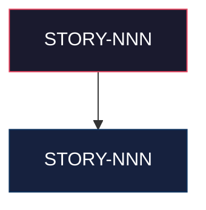

# Mapa de Implementação — <Nome do Projeto/Épico>

**Gerado a partir das dependências BlockedBy/Blocks de cada história do <EPIC-NNN>.**

---

## 1. Matriz de Dependências

| Story | Título | Blocked By | Blocks | Status |
| :--- | :--- | :--- | :--- | :--- |
| <STORY-NNN> | <Título> | — | <STORY-NNN> | <Status> |

> **Nota:** <Observações sobre dependências implícitas ou funcionais que não estão declaradas explicitamente nas histórias mas existem na prática.>

---

## 2. Fases de Implementação

> As histórias são agrupadas em fases. Dentro de cada fase, as histórias podem ser implementadas **em paralelo**. Uma fase só pode iniciar quando todas as dependências das fases anteriores estiverem concluídas.

```
╔══════════════════════════════════════════════════════════════════════════╗
║                   FASE 0 — <Nome da Fase> (paralelo)                   ║
║                                                                        ║
║   ┌─────────────┐                   ┌─────────────┐                    ║
║   │  STORY-NNN  │  <Escopo curto>   │  STORY-NNN  │  <Escopo curto>    ║
║   └──────┬──────┘                   └──────┬──────┘                    ║
╚══════════╪═════════════════════════════════╪════════════════════════════╝
           │                                 │
           ▼                                 ▼
╔══════════════════════════════════════════════════════════════════════════╗
║                   FASE 1 — <Nome da Fase>                              ║
║                                                                        ║
║   ┌──────────────────────────────────────────────────────────┐         ║
║   │  STORY-NNN  <Escopo>                                     │         ║
║   │  (← dependências)                                        │         ║
║   └──────────────────────────┬───────────────────────────────┘         ║
╚══════════════════════════════╪═════════════════════════════════════════╝
                               │
                               ▼
╔══════════════════════════════════════════════════════════════════════════╗
║                   FASE N — <Nome da Fase> (paralelo)                   ║
║                                                                        ║
║   ┌─────────────┐  ┌─────────────┐  ┌─────────────┐                   ║
║   │  STORY-NNN  │  │  STORY-NNN  │  │  STORY-NNN  │                   ║
║   │  <Escopo>   │  │  <Escopo>   │  │  <Escopo>   │                   ║
║   └─────────────┘  └─────────────┘  └─────────────┘                   ║
╚══════════════════════════════════════════════════════════════════════════╝
```

---

## 3. Caminho Crítico

> O caminho crítico (a sequência mais longa de dependências) determina o tempo mínimo de implementação do projeto.

```
STORY-NNN ─┐
            ├──→ STORY-NNN → STORY-NNN ──┐
STORY-NNN ─┘                              ├──→ STORY-NNN
                 STORY-NNN → STORY-NNN ──┘
   Fase 0           Fase 1       Fase 2            Fase 3
```

**<N> fases no caminho crítico, <N> histórias na cadeia mais longa (<sequência>).**

<Impacto de atrasos no caminho crítico.>

---

## 4. Grafo de Dependências (Mermaid)



---

## 5. Resumo por Fase

| Fase | Histórias | Camada | Paralelismo | Pré-requisito |
| :--- | :--- | :--- | :--- | :--- |
| 0 | <STORY-NNN, STORY-NNN> | <Camada arquitetural> | <N paralelas> | — |
| 1 | <STORY-NNN> | <Camada> | <N> | Fase 0 concluída |
| N | <STORY-NNN, NNN, NNN> | <Camada> | <N paralelas> | <Pré-requisito> |

**Total: <N> histórias em <N> fases.**

> **Nota:** <Observações sobre fases transversais, ordem de execução flexível, etc.>

---

## 6. Detalhamento por Fase

### Fase 0 — <Nome>

| Story | Escopo Principal | Artefatos Chave |
| :--- | :--- | :--- |
| <STORY-NNN> | <Descrição do escopo> | <Classes/componentes/migrations gerados> |

**Entregas da Fase 0:**

- <Entrega concreta 1>
- <Entrega concreta N>

### Fase N — <Nome>

| Story | Escopo Principal | Artefatos Chave |
| :--- | :--- | :--- |
| <STORY-NNN> | <Descrição> | <Artefatos> |

**Entregas da Fase N:**

- <Entrega>

---

## 7. Observações Estratégicas

### Gargalo Principal

<Identificar a história que é o maior gargalo — a que bloqueia mais histórias downstream. Explicar por que investir mais tempo nela compensa.>

### Histórias Folha (sem dependentes)

<Listar histórias que não bloqueiam nenhuma outra. São candidatas a paralelismo e podem absorver atrasos sem impacto no caminho crítico.>

### Otimização de Tempo

- <Onde o paralelismo é máximo>
- <Quais histórias podem começar imediatamente>
- <Como alocar equipes para acelerar>

### Dependências Cruzadas

<Histórias que dependem de ramos diferentes da árvore de dependências. Identificar pontos de convergência.>

### Marco de Validação Arquitetural

<Qual história deve servir como checkpoint de validação antes de expandir o escopo. O que ela valida (patterns, pipeline, integração).>
