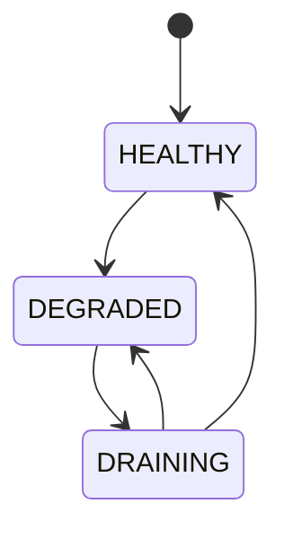

# <Nome> — <Subtítulo Descritivo>

> **Convenção de cross-references:** usar links relativos para outros serviços — `[NomeServiço](nome-servico.md)` ou `[NomeServiço](nome-servico.md#secao-especifica)`. Para documentos da raiz V2, usar `../` — ex: `[Padrões Globais](../02-padroes-globais.md)`. Manter links bidirecionais quando dois serviços se referenciam mutuamente.

---

## 1. Visão Geral

### Objetivo

<Descrição concisa (2-3 frases) do propósito do serviço. O que faz, o que NÃO faz, e qual é seu papel na plataforma.>

### Responsabilidades

- <Responsabilidade primária>
- <Módulo/componente interno relevante (`nome-modulo`) — o que resolve>
- <Regras/engine — mecanismo de decisão se aplicável>
- <Cache/storage — estratégia de armazenamento local>
- <Contingência — mecanismo de fallback se aplicável>
- <Comunicação externa — protocolo e destino>
- <Registro/auditoria — como persiste dados para rastreabilidade>

### Stack Tecnológico

| Componente           | Tecnologia                       | Detalhes                                                                           |
| :------------------- | :------------------------------- | :--------------------------------------------------------------------------------- |
| **Runtime**          |                                  | Stateless/Stateful. Deployment como `<nome>-core` dentro de cada <localização>.    |
| **Banco**            |                                  | Instância dedicada/compartilhada. Tabela(s) principal(is).                         |
| **Cache L1**         |                                  | Estratégia, sizing, TTL, invalidação.                                              |
| **Cache L2**         |                                  | Compartilhamento, protocolo, eviction policy.                                      |
| **Mensageria**       |                                  | Topics produzidos/consumidos.                                                      |
| **Fallback**         |                                  | Buffer local quando dependência indisponível.                                      |
| **Protocolo legado** |                                  | Se aplicável (ISO8583, gRPC, etc.).                                                |

> **Nota:** Remover linhas não aplicáveis ao serviço. Adicionar linhas específicas se necessário.

### Padrões Arquiteturais

> Referência: [Padrões Globais](../02-padroes-globais.md)

- **<Padrão 1>:** <Descrição de como o padrão se aplica a este serviço>
- **<Padrão 2>:** <Descrição>
- **<Padrão N>:** <Descrição>

### Localização

<Onde roda na topologia — Nível 1/2/3, namespace, deployment model.>

---

## 2. Regras de Negócio

### 2.1 State Machine (se aplicável)

```mermaid
stateDiagram-v2
    [*] --> <ESTADO_INICIAL>: <trigger>

    <ESTADO_INICIAL> --> <ESTADO_A>: <condição>
    <ESTADO_INICIAL> --> <ESTADO_B>: <condição>

    <ESTADO_A> --> <ESTADO_C>: <condição>

    <ESTADO_B> --> [*]
    <ESTADO_C> --> [*]
```

<Cada entidade principal do serviço que tenha ciclo de vida deve ter sua state machine explícita. Transições inválidas rejeitadas antes de qualquer persistência.>

**Estados:**

| Estado | Descrição | Terminal? |
| :--- | :--- | :--- |
| `<ESTADO>` | <Descrição> | Sim/Não |

**Transições válidas:**

| De → Para | Operação | Condição |
| :--- | :--- | :--- |
| <ESTADO_A> → <ESTADO_B> | <operação> | <condição para transição> |

### 2.2 Validações de Negócio

| Validação | Fonte de Dados | Resposta se Falhar |
| :--- | :--- | :--- |
| <Regra de validação> | <Cache/DB/Config> | <HTTP code + código de erro> |

### 2.3 Campos Derivados (se aplicável)

> **Campos derivados (não enviados no request):**
> - `<campo>` — <como é derivado, de qual fonte>

### 2.4 <Engine/Módulo de Decisão> (se aplicável)

<Se o serviço possui um engine de regras, pipeline de decisão, ou módulo de processamento complexo, detalhar aqui.>

**Tipos de <Regras/Decisões>:**

| Tipo | Propósito | Exemplo |
| :--- | :--- | :--- |
| **<TIPO_A>** | <Propósito> | <Exemplo concreto> |

**Contrato da <Regra/Entidade>:**

| Campo | Tipo | Descrição |
| :--- | :--- | :--- |
| `<campo>` | <tipo> | <descrição> |

**Pipeline de Avaliação:**

1. **<Etapa 1>:** <descrição>
2. **<Etapa 2>:** <descrição>
3. **<Etapa N>:** <descrição>

### 2.5 Idempotency (se aplicável)

**Contrato:**

- **Header/Campo:** `<header ou campo de idempotência>` (obrigatório em <quais operações>)
- **Formato:** <formato esperado>
- **Escopo:** <escopo da chave>

**Comportamento:**

| Cenário | Ação |
| :--- | :--- |
| Primeira request | <comportamento> |
| Request duplicada (cache hit) | <comportamento> |
| Request duplicada (cache miss, DB hit) | <comportamento> |

**Storage:**

| Camada | Chave | TTL | Propósito |
| :--- | :--- | :--- | :--- |
| <Cache> | <formato da chave> | <TTL> | <propósito> |
| <DB> | <constraint> | <retenção> | <propósito> |

---

## 3. Especificações de Plataforma

### 3.1 Timeouts & Circuit Breakers

#### Timeout Cascade (se o serviço participa de cadeia síncrona)

> Quando o serviço faz parte de uma cadeia síncrona multi-camada (ex: SDK → Gateway → Adquirente), os timeouts devem formar uma cascata onde cada camada tem margem para receber a resposta da camada abaixo, processar e devolver. **Regra:** timeout da ponta (downstream) < timeout do serviço < timeout do caller (upstream). Isso evita respostas órfãs e retentativas desnecessárias. Ver [Huginn — Timeout Cascade](huginn.md#31-timeouts--circuit-breakers) como referência.

| Camada | Timeout | Valor Default | Lógica |
| :--- | :--- | :--- | :--- |
| **<Downstream>** (serviço → dependência) | T | <valor> | Base da cadeia. <descrição> |
| **<Este serviço>** (end-to-end) | T + <margem> | <valor> | Absorve downstream + processamento interno |
| **<Upstream>** (caller → este serviço) | T + <margem maior> | <valor> | Absorve este serviço + latência de rede |

> **Nota:** Remover esta subseção se o serviço não participa de cadeia síncrona com timeouts interdependentes.

#### Timeouts e Circuit Breakers

| Timeout | Valor | Escopo | Comportamento |
| :--- | :--- | :--- | :--- |
| **<Timeout A>** | <valor> | <escopo> | <o que acontece quando excede> |
| **Circuit Breaker Threshold** | <N falhas> | <entre quais componentes> | <ação ao abrir> |
| **Circuit Breaker Half-Open** | <intervalo> | <entre quais componentes> | <probe de recovery> |
| **Cache TTL** | <valor> | <qual cache> | <invalidação> |

### 3.2 Retry Logic & Failover

| Tipo de Erro | Retries | Backoff | Ação |
| :--- | :--- | :--- | :--- |
| <Erro transiente> | <N> | <estratégia> | <ação após esgotar retries> |
| <Erro lógico> | 0 | — | Fail fast. <resposta> |
| <Circuit breaker aberto> | 0 | — | Fail fast. <resposta> |

### 3.3 Rate Limiting & Backpressure (se aplicável)

| Limite | Escopo | Mecanismo | Valor Default |
| :--- | :--- | :--- | :--- |
| <Limite A> | <Infra/Negócio> | <mecanismo> | <valor> |

**Resposta:** `429 Too Many Requests` com header `Retry-After: <seconds>`.

### 3.4 <Mecanismo de Contingência> (se aplicável)

<Se o serviço possui um mecanismo de contingência (SiP, fallback, degraded mode), detalhar aqui.>

**State Machine da Contingência:**

**Parâmetros:**

| Parâmetro | Valor | Justificativa |
| :--- | :--- | :--- |
| **<Param>** | <valor> | <por que este valor> |

**Regras:**

| Regra | Descrição |
| :--- | :--- |
| <Regra> | <descrição> |

### 3.5 Modelo de Dados

<Tabela(s) principal(is). Descrever campos, constraints, regras de segurança (RBAC, imutabilidade).>

**Regra de Segurança:** <RBAC, permissões, compliance>.

**Campos principais:**

| Campo | Tipo | Obrigatório | Descrição |
| :--- | :--- | :--- | :--- |
| `<campo>` | <tipo> | <Sim/Não/Condicional> | <descrição> |

**Constraints:** <UNIQUE, CHECK, FK, etc.>

**Fluxo de Escrita:** <INSERT → Kafka → Fallback, etc.>

### 3.6 <Mapeamento de Protocolo> (se aplicável)

<Se o serviço traduz entre protocolos (REST ↔ ISO8583, REST ↔ gRPC, etc.), detalhar mapeamentos aqui.>

### 3.7 <Cache/Tabelas Externas> (se aplicável)

<Se o serviço consome dados de outro serviço via cache, detalhar origem, invalidação e impacto.>

### 3.8 Métricas e Alertas

**Métricas Técnicas (Infraestrutura):**

| Métrica | Warning | Critical | Ação |
| :--- | :--- | :--- | :--- |
| `<metrica_latencia>` | > <valor> | > <valor> | <ação de investigação> |
| `<metrica_disponibilidade>` | < <valor> | < <valor> | <ação> |
| `<metrica_erros>` | > <valor>% | > <valor>% | <ação> |

**Métricas de Negócio:**

| Métrica | Tipo | Descrição |
| :--- | :--- | :--- |
| `<metrica_negocio>` | <Counter/Gauge/Histogram> | <o que mede> |

---

## 4. Contratos de Dados (Referência)

<Seção para detalhar objetos complexos que compõem os payloads das APIs. Cada sub-objeto relevante deve ter sua própria subseção.>

### 4.N <NomeDoObjeto>

| Campo | Tipo | Obrigatório | Descrição |
| :--- | :--- | :--- | :--- |
| `<campo>` | <tipo> | <Sim/Não/Condicional> | <descrição> |

**Sub-objeto `<nome>` (se aplicável):**

| Campo | Tipo | Obrigatório | Descrição |
| :--- | :--- | :--- | :--- |
| `<campo>` | <tipo> | <Sim/Não/Condicional> | <descrição> |

### 4.N Response Schema e Error Codes

**Campos do Response:**

| Campo | Tipo | Presença | Descrição |
| :--- | :--- | :--- | :--- |
| `<campo>` | <tipo> | <Sempre/Condicional> | <descrição> |

**Error codes:**

| HTTP | Cenário | Código no body | Ação do Client |
| :--- | :--- | :--- | :--- |
| <status> | <cenário> | `<CODIGO>` | <ação esperada do client> |

---

## 5. Jornadas (Operacionais / Transacionais)

<Cada operação principal do serviço deve ter sua jornada detalhada. Jornadas descrevem o fluxo completo de uma operação, incluindo pré-condições, regras aplicáveis, campos obrigatórios, mapeamentos e cenários de erro.>

### 5.N — <Nome da Jornada>

**Endpoint:** `<MÉTODO> <path>`
**Protocolo:** <REST/gRPC/Kafka/ISO8583>
**Transição de estado:** <ESTADO_A> → <ESTADO_B> / <ESTADO_C>

#### Pré-condições
- <Condição 1 que deve ser verdadeira>
- <Condição 2>

#### Regras de Negócio Aplicáveis
- <Referência às validações da seção 2.2>
- <Regras específicas desta jornada>

#### Campos Obrigatórios

`<campo1>`, `<campo2>`, `<campo3>`

Ou, para jornadas com campos específicos:

| Campo | Tipo | Descrição |
| :--- | :--- | :--- |
| `<campo>` | <tipo> | <descrição> |

#### Campos Derivados
- <campo> → <como é derivado>

#### Mapeamento <Protocolo> Relevante (se aplicável)
<Mapeamento específico para esta operação>

#### Cenários de Erro

| Cenário | HTTP | Código |
| :--- | :--- | :--- |
| <Cenário de erro> | <status> | `<CODIGO>` |

---

## 6. Jornadas de Sincronização (se aplicável)

<Jornadas assíncronas: eventos recebidos de outros serviços, processamento de filas, sincronização de dados.>

### 6.N — <Nome da Jornada de Sincronização>

**Trigger:** <Evento Kafka / Cron / Webhook>
**Origem:** [<Serviço>](<servico>.md)
**Destino:** <Cache/DB/Componente interno>

**Fluxo:**

1. <Passo 1>
2. <Passo 2>
3. <Passo N>

**Dados envolvidos:** <Campos/entidades afetadas>.

**Impacto:** <O que acontece se dados desatualizados>.

**Contingência:** <Fallback se fonte indisponível>.

---

## 7. Dependências

### Hard (Obrigatórias)

- <Serviço/recurso sem o qual NÃO funciona>

### Soft (Degradáveis)

- <Serviço/recurso cuja ausência degrada mas não impede operação — explicar mecanismo de degradação>

### Contingência

- <Mecanismo que absorve indisponibilidade de cada dependência soft>

---

## 8. Interfaces (Resumo de Endpoints)

### Endpoints Expostos (REST/JSON)

| Endpoint | Método | Descrição | SLO Latência (p95) | SLO Disponibilidade |
| :--- | :--- | :--- | :--- | :--- |
| `<path>` | <MÉTODO> | <descrição> | < <valor> | <valor>% |

> **<Nota sobre decisão arquitetural de endpoints, se relevante>**

**Headers obrigatórios (se aplicável):**

| Header | Formato | Descrição |
| :--- | :--- | :--- |
| `<header>` | <formato> | <propósito> |

### Consome (Requires)

| Origem | Interface | Protocolo | Propósito |
| :--- | :--- | :--- | :--- |
| <Serviço/Recurso> | <Interface> | <Protocolo> | <Propósito> |
